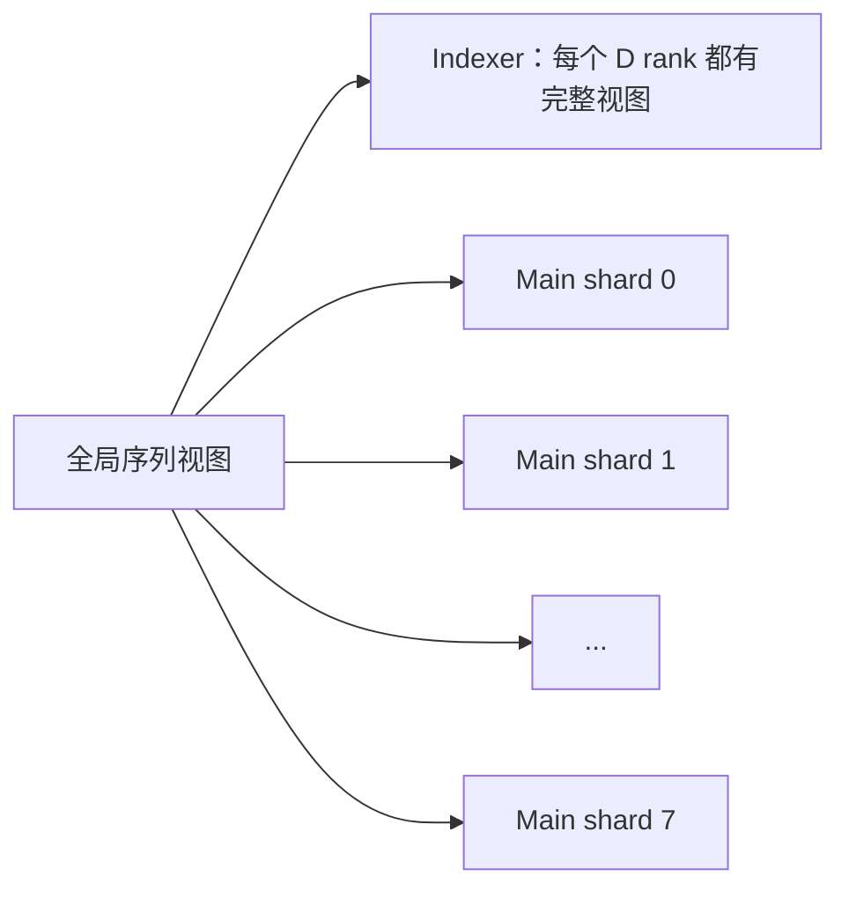
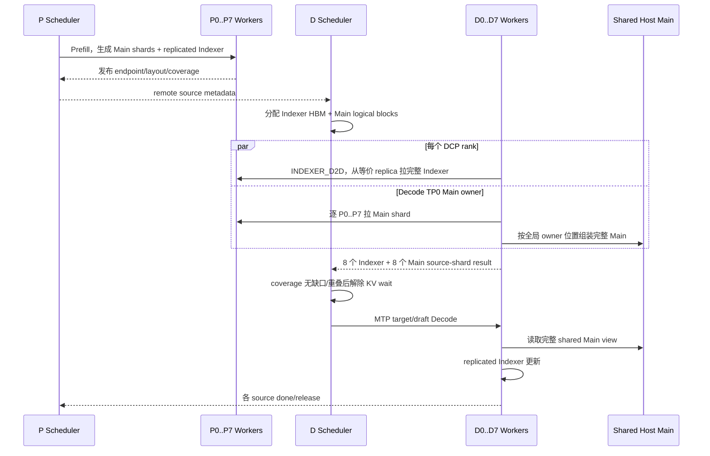

# Blockwise DSA 对称 DCP=8 设计复核

本文分析 `mte_fuse_0723_mooncake_test_0827_add_block` 在
**P DCP=8 / D DCP=8** 下的失败，并给出可评审的控制面、数据面、时序和
逻辑/物理内存方案。当前只做设计，不直接修改运行代码。

基线：vLLM Ascend 0.25rc1、GLM-5.2 W8A8、Mooncake 0.3.13、
`MooncakeConnector + dsa_pd_offload`、Decode fused offload。

## 1. 日志证据必须按代码路径分开

用户确认测试机已经解除两个 guard，但该现场改动没有上传。因此 guard 只能说明仓库默认代码的
能力边界，**不能作为用户所述最新运行的根因**。

当前归档中有两条一手错误链：

| 路径 | 一手错误 | 能证明的范围 |
| --- | --- | --- |
| 旧 layerwise / ConnectorV1 | `_get_kv_split_metadata` 访问 `remote_block_ids[group_idx]` 发生 `IndexError` | MTP 开关均复现，DCP 关后消失；说明旧路径的 DCP group 元数据不对齐 |
| add_block P8/D1 | `remote_scale=8`、`local_scale=1`，source/destination 物理覆盖不相等 | 非对称物理页映射没有实现；临时 `min(...)` 只保留一个物理页 |

旧 `IndexError` 不能直接套到 add_block；实验 issue 010 也明确记录 add_block 当时尚未进入请求 KV
路径。对于用户所述“两个 guard 已解除、P Ready、D 失败”的最新 add_block 运行，仓库里还缺少
解除 guard 后的首个 traceback 和 phase 计数，因此具体爆点保持未知。

本文后续只依据可由代码静态确认的结构性缺口设计方案：单 endpoint 派发、Decode TP0 Main owner、
P8/D1 截断传输以及 offload 与 DCP attention metadata 未组合。

## 2. 为什么不能只删除两个 guard

当前有三道能力门槛：

1. `AscendSFAKVOffloadImpl` 明确拒绝 CP。
2. blockwise DSA connector 明确拒绝 Decode DCP/PCP。
3. 即使删除前两道，offload backend 仍优先选择非 CP 的
   `AscendSFAKVOffloadMetadataBuilder` / `AscendSFAKVOffloadImpl`，不会进入
   `AscendSFADCPMetadataBuilder` / `AscendSFADCPImpl`。

第三点是关键。原生 SFA DCP 路径包含以下语义，而 offload 路径目前没有：

- replicated Indexer 的 block table 和 slot mapping；
- global top-k 到 DCP-local Main KV 索引的 remap；
- DCP query all-gather；
- 各 DCP shard 的 partial attention output 和 LSE 合并。

直接删除第二个校验最多让服务继续启动，不能证明 attention 语义正确。

## 3. 当前 blockwise DSA 的结构缺口

### 3.1 控制面只认识 TP/DP/PP

`_DsaParallelTopology` 只有 `tp_size/dp_size/pp_size`；`RemoteEndpoint` 没有
CP rank；`RemoteSource.endpoints_by_prefill_rank` 只按 Prefill TP rank 排列。
当前 worker 用：

```text
leader_rank = decode_tp_rank * (P_TP / D_TP)
```

选一个 P endpoint。DCP 恰好与 TP rank 同号，只是当前进程布局的偶然条件，协议没有表达
“这个 endpoint 是哪个 CP shard”。

### 3.2 Main 只有 TP0 owner

Decode Host pool 是所有 TP rank 映射的一段 Mooncake shared segment，但 Main layout
只在 owner rank 建立。`_dsa_main_owner=false` 的 rank 不生成 `MAIN_D2RH` 描述符。

这在 DCP=1 时避免 Main 重复传输；在真 DCP=8 下，八个 P rank 持有不同 Main 序列分片，
TP0 无法靠当前单 endpoint 命令收齐全部分片。

首期正确性方案应保留这个所有权模型：**仍由 Decode TP0 单独建立 Main layout 和写 shared
Host pool，但 TP0 必须从 P0…P7 八个 CP source 聚合全部 Main shards。**“各 D rank 并行写
Host”是后续利用 MemFabric 多 TP 互传的优化方向，不是当前实现，也不是首期最小改法。

### 3.3 Indexer 和 Main 的 CP 语义不同

SFA DCP 的 Indexer 在每个 DCP rank 上是完整 replicated view；Main KV 是 DCP-local shard。
因此不能用统一的 `min(source_physical, destination_physical)` 规则处理两者：

- Indexer 应明确选择或组装完整 replicated view；
- Main 应按 owner rank 搬运全部互不重叠的 shards。

### 3.4 fused offload 没有 DCP partial merge 合同

真 DCP attention 每个 rank 只看到本地 Main shard。局部 softmax 结果必须携带 LSE，跨 DCP
合并后才是全局结果。当前 `npu_fused_sparse_attention_overlap` 调用只返回 attention output，
offload 实现没有 DCP LSE merge。若算子接口不能返回 partial output + LSE，就不能直接实现
“每 rank 只读本地 Host shard”的真 DCP fused 路径。

### 3.5 P8/D1 + MTP 的“通过”不能证明数据正确

P8/D1 首次进入 add_block receive 时，报错位置在第一个 `INDEXER_D2D` 规划：一个逻辑 source
block 按 `remote_scale=8` 展开为八个物理页，一个 Decode destination 按 `local_scale=1` 只有一个
物理页。现场补丁使用 `min(...)` 后只复制第一对物理页。

Main 又是独立问题：当前 D TP0 只选择一个 P leader endpoint，所以最多拉到该 endpoint 持有的
Main shard。MTP 只在这份不完整 target KV 上继续 draft/verify，不会自动补齐丢失的 CP shards。

当前“精度 5/5”只是返回文本的期望子串检查，压测只检查 HTTP 成功和时延。模型在缓存缺失、
未初始化或错误映射时仍可能产生文本，所以这些结果只能称为链路冒烟，不能称为非对称 DCP 正确。

## 4. 目标逻辑视图

令 `C=8`，`I=cp_kv_cache_interleave_size`。全局 token 位置 `t` 的 owner 为：

```text
chunk = floor(t / I)
owner = chunk mod C
local_chunk = floor(chunk / C)
local_token = local_chunk * I + (t mod I)
```

逻辑上：



Indexer 的“复制”指每个 DCP rank 都能索引完整历史；Main 的“分片”指每个 rank 只保存
`owner == dcp_rank` 的历史内容。

## 5. 推荐的数据面

### 5.1 Indexer：D2D，完整 replicated view

每个 `D_i` 从一个明确的 P endpoint 拉完整 Indexer。为分散 P 侧读带宽，可使用
`D_i <- P_i`，但协议必须标注该 component 为 `REPLICATED`，并验证所有 P replicas 的
layout fingerprint 相同。

```text
P0 Indexer(full) ──> D0 Indexer(full)
P1 Indexer(full) ──> D1 Indexer(full)
...
P7 Indexer(full) ──> D7 Indexer(full)
```

传输规划按 global token interval 生成，不再按两个列表的最小长度静默截断。

### 5.2 Main 首期：TP0 聚合所有 P shards

```text
P0 Main(shard0) ─┐
P1 Main(shard1) ─┤
...              ├──> D TP0 owner ──> Shared Host Main(full)
P7 Main(shard7) ─┘                         │
                                          └──> D0...D7 只读
```

这与当前 Host pool 所有权一致：只有 Decode TP0 建立 Main layout 并写 shared segment。需要修改
的是 TP0 的 source 选择，从单个 `leader_rank` endpoint 改成按 CP shard 遍历 P0…P7，并把八份
Main shard 写到全局 Host view 的对应位置。

shared Host pool 推荐使用全局交错物理编号：

```text
host_physical_block = local_block * C + owner
```

同一个 scheduler virtual block 对应八个 Host physical blocks；首期全部由 TP0 写入，其他 D ranks
映射后只读。布局必须把 `C`、`I`、block size、num blocks 和 layout epoch 放进 fingerprint。

### 5.3 完成条件

一个请求只有同时满足以下条件才能从 `WAITING_FOR_REMOTE_KVS` 进入 Decode：

```text
8 × INDEXER_D2D complete（每个 D rank 一项）
AND
8 × MAIN source-shard complete（全部由 D TP0 汇报）
AND
all layout/coverage checks pass
```

每个 D rank 只向自己实际读取的 P endpoint 发送 done/release。Scheduler 聚合结果时使用
`(request_id, component, source_dcp_rank, destination_tp_rank)`。Main 虽只有 TP0 writer，也不能把
“TP0 一次 command 完成”误当作八个 source shards 全部完成。

## 6. attention/offload 的实现选择

### 方案 A：TP0 多 source 的完整 Host view，首期正确性

Decode TP0 从八个 P CP sources 聚合完整 Main KV，写入 shared Host pool；每个 D rank 的 fused
kernel 都能看到完整 Host KV，使用全局 top-k 计算自己的 TP heads。

优点：不需要 partial output/LSE merge，比较接近当前 fused operator 合同。

缺点：这不是“Main KV 按 DCP rank 做稀疏计算”的真 DCP；DCP 通信和 metadata 仍要正确处理，
计算收益有限。只能作为 bring-up fallback，不能对外宣称 DCP 性能能力。

### 方案 B：Main shard + partial SFA/LSE merge，语义完整

每个 D rank 只读本地 Host shard，把 global top-k remap 为 local top-k，执行 partial SFA，
再按 `AscendSFADCPImpl` 的方式合并 output/LSE。

优点：是真 DCP，Main 访问和稀疏计算均分散到八个 ranks。

缺点：当前 fused operator 合同不足。需要以下一种能力：

1. fused operator 返回 partial output 与 LSE；或
2. 先把各 rank 命中的 selected KV all-gather 成完整小集合，再执行一次完整 SFA。

### 方案 C：多 D rank 并行写 shared Host，后续传输优化

让 `D_i <- P_i` 并行搬运 Main shard，可利用 MemFabric 多 TP 互传并减轻 TP0 压力。但这要求
shared segment 的跨 rank 注册、无重叠物理区间、八 writer barrier、失败回滚和 release 语义均已
定义。它改变当前 TP0 owner 合同，不适合作为首期正确性补丁。

推荐先实现方案 A，建立可验证的完整 KV 基线；正式扩展目标再选择 B。方案 C 只改变传输并行度，
不能替代 B 所需的 DCP attention 语义。

## 7. 控制面修改范围

### 7.1 `mooncake_dsa_metadata.py`

- `RemoteEndpoint` 增加 `tp_rank`、`dcp_rank`、layout epoch。
- `RemoteSource` 按 component 描述 replication mode、source shards 和 block coverage。
- `DsaStepRequest` 携带每个 component 的逻辑 token interval，不仅是无类型 block ID 列表。
- `DsaLocalResult` 增加 `dcp_rank` 与 phase coverage counters。

### 7.2 `mooncake_connector.py`

- `_DsaParallelTopology` 增加 DCP/PCP，并首先限制 `PCP=1`、`DCP==TP`。
- Indexer 用显式 `(tp_rank, dcp_rank)` 选一个等价 replica；Main owner TP0 获取全部 P CP endpoints。
- Indexer/Main 分别调用 component-specific planner。
- 首期保持非 owner rank 的 Main transfer 为空，由 TP0 逐 source shard 写完整 shared Host view。
- 完成聚合分别等待八个 Indexer rank 和 TP0 的八个 Main source-shard results。
- 删除 hard guard 只能放在上述能力检查完成之后。

### 7.3 `host_pool.py`、`model_runner_v1.py`

- Host layout 增加 DCP interleave 描述和全局物理块容量。
- 首期保持 TP0 创建并写 shared segment，所有 D ranks 映射完整只读 view。
- 内存规划按“完整序列一份”计费，不能每个 rank 重复申请完整 DRAM。

### 7.4 `sfa_v1.py`、`sfa_kv_offload.py`

- backend 选择增加 `offload + DCP` 组合，不能继续让 offload 优先级覆盖 CP backend。
- metadata builder 组合 replicated Indexer DCP metadata 与 offload 的 request/token metadata。
- MTP `build_for_drafting` 和 graph capture 使用同一套 DCP static buffers。
- 正式方案 B 需要 local top-k remap、partial output/LSE merge。

### 7.5 `kv_offload_decode_manager.py`

- block table 同时保留 global view 与 rank-local view。
- 新 token 的 Main 写入必须按 DCP owner 落到正确 Host physical block。
- fused membership、selection buffer 和 MTP rows 按 DCP rank 隔离，避免 shared segment 中重叠写。

## 8. 时序



图捕获前必须完成所有 capacity 分配，包括 DCP query buffer、selection/membership、MTP 最大 row
和 Host shard views；capture/runtime 中不能重新分配或修改 layout epoch。

## 9. 建议的实现与测试阶梯

不要一次叠加 DCP、MTP、图模式和性能压测。建议按以下门槛推进：

1. **纯 CPU UT**：C=2/8 的 token interval、global/local block 映射、无缺口/无重叠。
2. **connector UT**：Indexer component-specific packing 不截断；TP0 从 C 个 Main sources 生成
   无缺口、无重叠的完整 Host coverage。
3. **P DCP=2 / D DCP=1 eager、MTP关**：先证明 TP0 多 source 重组，逐 token 对齐 DCP=1 基线。
4. **P/D DCP=2，再到 8，eager、MTP关**：加入 CP-aware offload metadata 后做相同检查。
5. **DCP=8、MTP P1/D3、draft eager**：候选/接受/拒绝、target/draft cache identity。
6. **FULL_DECODE_ONLY**：先 capture，再同样的精度集；确认 runtime 无重新分配。
7. **并发/长序列**：最后测 TTFT/TPOT，且同时上报每个 P/D rank 的 transfer bytes。

每轮只外传以下脱敏指标：配置枚举、commit/dirty、Ready/capture、错误码、每 rank/phase 页数和
byte 数、coverage 缺口/重叠、首次 token 分歧、MTP 汇总和性能分位数。

## 10. 当前决策建议

1. 不把未上传的 guard 改动或旧 layerwise `IndexError` 当作最新 add_block 失败根因。
2. 不继续用删除 guard 或 `min(source, destination)` 作为下一轮实机补丁。
3. 先做方案 A：TP0 多 source 聚合、组件独立规划、逐 source coverage barrier；用 token 级基线
   证明数据完整后，再进入对称 DCP attention。
4. 首期只支持 `PCP=1`、P/D `DCP==TP`、P_DCP==D_DCP、block size 等于 CP interleave，
   避免同时引入 PCP 和非对称映射。
5. MTP 和图模式在 DCP 基础数据面通过后再打开。最新日志尚未覆盖它们。
