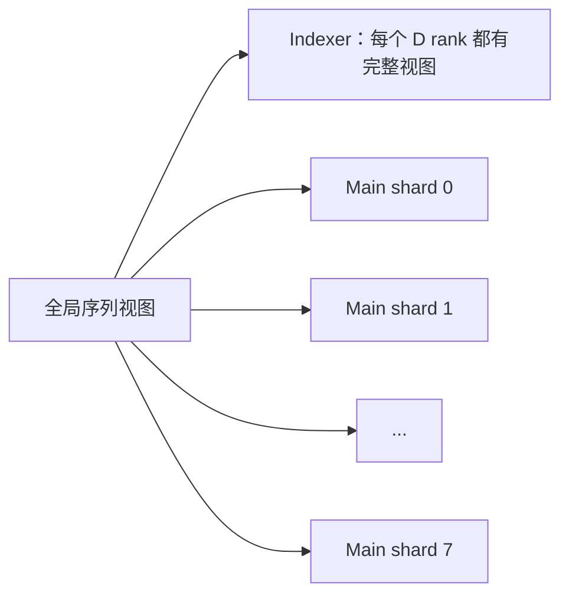
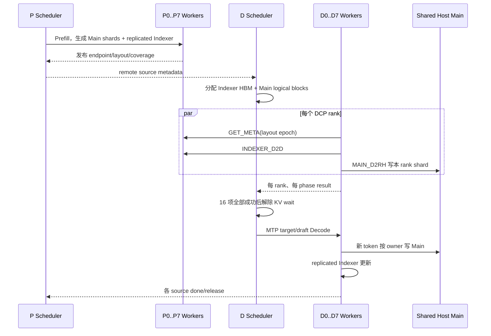

# Blockwise DSA 对称 DCP=8 设计复核

本文分析 `mte_fuse_0723_mooncake_test_0827_add_block` 在
**P DCP=8 / D DCP=8** 下的失败，并给出可评审的控制面、数据面、时序和
逻辑/物理内存方案。当前只做设计，不直接修改运行代码。

基线：vLLM Ascend 0.25rc1、GLM-5.2 W8A8、Mooncake 0.3.13、
`MooncakeConnector + dsa_pd_offload`、Decode fused offload。

## 1. 最新日志能证明什么

0831 实验分支最新 tip 为 `bab99d9c5`，生产代码基线仍为 `d1bf0bad2`，
现场打了 `ALLOW_DCP8_OFFLOAD`，所以 collect 记录 `dirty=true`。

| 项目 | 事实 | 边界 |
| --- | --- | --- |
| P | DCP=8，Ready | P 侧启动完成 |
| D | DCP=8，模型权重和内存 profile 完成后失败 | 还未进入图捕获和请求传输 |
| 第一层限制 | `sfa_kv_offload.py` 的 `enable_cp()` 拒绝已被现场移除 | 只说明越过第一道 guard |
| 第二层限制 | `MooncakeConnector.__init__` 拒绝 `DCP * PCP != 1` | 当前直接根因 |
| MTP | 实验 facts 明确是 `MTP=0` | 尚未验证 MTP=3 |
| 图模式 | 配方声明图开，但 D 在 connector 初始化失败 | 没有发生 graph capture |

因此这次失败不是 Mooncake 传输错误，也不是 MTP 或图模式错误。它发生在 Decode
connector 初始化，服务尚未创建可执行请求的数据面。

## 2. 为什么不能继续只删第二个校验

当前有三道能力门槛：

1. `AscendSFAKVOffloadImpl` 明确拒绝 CP。
2. blockwise DSA connector 明确拒绝 Decode DCP/PCP。
3. 即使删除前两道，offload backend 仍优先选择非 CP 的
   `AscendSFAKVOffloadMetadataBuilder` / `AscendSFAKVOffloadImpl`，不会进入
   `AscendSFADCPMetadataBuilder` / `AscendSFADCPImpl`。

第三点是关键。原生 SFA DCP 路径包含以下语义，而 offload 路径目前没有：

- replicated Indexer 的 block table 和 slot mapping；
- global top-k 到 DCP-local Main KV 索引的 remap；
- DCP query all-gather；
- 各 DCP shard 的 partial attention output 和 LSE 合并。

直接删除第二个校验最多让服务继续启动，不能证明 attention 语义正确。

## 3. 当前 blockwise DSA 的结构缺口

### 3.1 控制面只认识 TP/DP/PP

`_DsaParallelTopology` 只有 `tp_size/dp_size/pp_size`；`RemoteEndpoint` 没有
CP rank；`RemoteSource.endpoints_by_prefill_rank` 只按 Prefill TP rank 排列。
当前 worker 用：

```text
leader_rank = decode_tp_rank * (P_TP / D_TP)
```

选一个 P endpoint。DCP 恰好与 TP rank 同号，只是当前进程布局的偶然条件，协议没有表达
“这个 endpoint 是哪个 CP shard”。

### 3.2 Main 只有 TP0 owner

Decode Host pool 是所有 TP rank 映射的一段 Mooncake shared segment，但 Main layout
只在 owner rank 建立。`_dsa_main_owner=false` 的 rank 不生成 `MAIN_D2RH` 描述符。

这在 DCP=1 时避免 Main 重复传输；在真 DCP=8 下，八个 P rank 持有不同 Main 序列分片，
TP0 无法靠当前单 endpoint 命令收齐全部分片。

### 3.3 Indexer 和 Main 的 CP 语义不同

SFA DCP 的 Indexer 在每个 DCP rank 上是完整 replicated view；Main KV 是 DCP-local shard。
因此不能用统一的 `min(source_physical, destination_physical)` 规则处理两者：

- Indexer 应明确选择或组装完整 replicated view；
- Main 应按 owner rank 搬运全部互不重叠的 shards。

### 3.4 fused offload 没有 DCP partial merge 合同

真 DCP attention 每个 rank 只看到本地 Main shard。局部 softmax 结果必须携带 LSE，跨 DCP
合并后才是全局结果。当前 `npu_fused_sparse_attention_overlap` 调用只返回 attention output，
offload 实现没有 DCP LSE merge。若算子接口不能返回 partial output + LSE，就不能直接实现
“每 rank 只读本地 Host shard”的真 DCP fused 路径。

## 4. 目标逻辑视图

令 `C=8`，`I=cp_kv_cache_interleave_size`。全局 token 位置 `t` 的 owner 为：

```text
chunk = floor(t / I)
owner = chunk mod C
local_chunk = floor(chunk / C)
local_token = local_chunk * I + (t mod I)
```

逻辑上：



Indexer 的“复制”指每个 DCP rank 都能索引完整历史；Main 的“分片”指每个 rank 只保存
`owner == dcp_rank` 的历史内容。

## 5. 推荐的数据面

### 5.1 Indexer：D2D，完整 replicated view

每个 `D_i` 从一个明确的 P endpoint 拉完整 Indexer。为分散 P 侧读带宽，可使用
`D_i <- P_i`，但协议必须标注该 component 为 `REPLICATED`，并验证所有 P replicas 的
layout fingerprint 相同。

```text
P0 Indexer(full) ──> D0 Indexer(full)
P1 Indexer(full) ──> D1 Indexer(full)
...
P7 Indexer(full) ──> D7 Indexer(full)
```

传输规划按 global token interval 生成，不再按两个列表的最小长度静默截断。

### 5.2 Main：每个 D rank 拉对应 P shard

```text
P0 Main(shard0) ──> D0 Host shard0
P1 Main(shard1) ──> D1 Host shard1
...
P7 Main(shard7) ──> D7 Host shard7
```

八个 D rank 并行写 shared segment 中互不重叠的物理区域。这样可以使用 MemFabric/Mooncake
多 TP 互传，并消除 TP0 的单点传输压力。

shared Host pool 推荐使用全局交错物理编号：

```text
host_physical_block = local_block * C + owner
```

同一个 scheduler virtual block 对应八个 Host physical blocks；每个 D rank 只写自己的
`owner` 槽位。布局必须把 `C`、`I`、block size、num blocks 和 layout epoch 放进 fingerprint。

### 5.3 完成条件

一个请求只有同时满足以下条件才能从 `WAITING_FOR_REMOTE_KVS` 进入 Decode：

```text
8 × INDEXER_D2D complete
AND
8 × MAIN_D2RH complete
AND
all layout/coverage checks pass
```

每个 D rank 只向自己实际读取的 P endpoint 发送 done/release。Scheduler 聚合结果时使用
`(request_id, tp_rank, dcp_rank, phase)`，不能只按 TP rank 或 TP0 完成判断。

## 6. attention/offload 有两个实现选择

### 方案 A：完整 Host view，功能优先

八个 D rank 共同把完整 Main KV 写入 shared Host pool；每个 rank 的 fused kernel 都能看到完整
Host KV，使用全局 top-k 计算自己的 TP heads。

优点：不需要 partial output/LSE merge，比较接近当前 fused operator 合同。

缺点：这不是“Main KV 按 DCP rank 做稀疏计算”的真 DCP；DCP 通信和 metadata 仍要正确处理，
计算收益有限。只能作为 bring-up fallback，不能对外宣称 DCP 性能能力。

### 方案 B：Main shard + partial SFA/LSE merge，语义完整

每个 D rank 只读本地 Host shard，把 global top-k remap 为 local top-k，执行 partial SFA，
再按 `AscendSFADCPImpl` 的方式合并 output/LSE。

优点：是真 DCP，Main 访问和稀疏计算均分散到八个 ranks。

缺点：当前 fused operator 合同不足。需要以下一种能力：

1. fused operator 返回 partial output 与 LSE；或
2. 先把各 rank 命中的 selected KV all-gather 成完整小集合，再执行一次完整 SFA。

推荐把方案 B 作为正式目标。若短期必须先看 P8/D8+MTP+图能否走通，可以实现方案 A，
但必须用显式 capability 名称和日志标注 `full_host_fallback`，避免误判性能。

## 7. 控制面修改范围

### 7.1 `mooncake_dsa_metadata.py`

- `RemoteEndpoint` 增加 `tp_rank`、`dcp_rank`、layout epoch。
- `RemoteSource` 按 component 描述 replication mode、source shards 和 block coverage。
- `DsaStepRequest` 携带每个 component 的逻辑 token interval，不仅是无类型 block ID 列表。
- `DsaLocalResult` 增加 `dcp_rank` 与 phase coverage counters。

### 7.2 `mooncake_connector.py`

- `_DsaParallelTopology` 增加 DCP/PCP，并首先限制 `PCP=1`、`DCP==TP`。
- 用显式 `(tp_rank, dcp_rank)` 选 endpoint。
- Indexer/Main 分别调用 component-specific planner。
- 非 owner rank 建立自己的 Main shard layout，允许多 rank 写 shared segment 的不重叠区域。
- 完成聚合等待所有 DCP ranks 和两个 phases。
- 删除 hard guard 只能放在上述能力检查完成之后。

### 7.3 `host_pool.py`、`model_runner_v1.py`

- Host layout 增加 DCP interleave 描述和全局物理块容量。
- 每个 rank 暴露自己的 shard view；owner 仍只负责创建 shared segment，不再垄断写入。
- 内存规划按“完整序列一份”计费，不能每个 rank 重复申请完整 DRAM。

### 7.4 `sfa_v1.py`、`sfa_kv_offload.py`

- backend 选择增加 `offload + DCP` 组合，不能继续让 offload 优先级覆盖 CP backend。
- metadata builder 组合 replicated Indexer DCP metadata 与 offload 的 request/token metadata。
- MTP `build_for_drafting` 和 graph capture 使用同一套 DCP static buffers。
- 正式方案 B 需要 local top-k remap、partial output/LSE merge。

### 7.5 `kv_offload_decode_manager.py`

- block table 同时保留 global view 与 rank-local view。
- 新 token 的 Main 写入必须按 DCP owner 落到正确 Host physical block。
- fused membership、selection buffer 和 MTP rows 按 DCP rank 隔离，避免 shared segment 中重叠写。

## 8. 时序



图捕获前必须完成所有 capacity 分配，包括 DCP query buffer、selection/membership、MTP 最大 row
和 Host shard views；capture/runtime 中不能重新分配或修改 layout epoch。

## 9. 建议的实现与测试阶梯

不要一次叠加 DCP、MTP、图模式和性能压测。建议按以下门槛推进：

1. **纯 CPU UT**：C=2/8 的 token interval、global/local block 映射、无缺口/无重叠。
2. **connector UT**：replicated Indexer 只生成完整覆盖，sharded Main 汇总覆盖等于全局范围。
3. **DCP=2 eager、MTP关**：P/D Ready；1、2、3、8 个 interleave 边界的精确 token 对齐。
4. **DCP=8 eager、MTP关**：同样的覆盖与精度检查。
5. **DCP=8、MTP P1/D3、draft eager**：候选/接受/拒绝、target/draft cache identity。
6. **FULL_DECODE_ONLY**：先 capture，再同样的精度集；确认 runtime 无重新分配。
7. **并发/长序列**：最后测 TTFT/TPOT，且同时上报每个 P/D rank 的 transfer bytes。

每轮只外传以下脱敏指标：配置枚举、commit/dirty、Ready/capture、错误码、每 rank/phase 页数和
byte 数、coverage 缺口/重叠、首次 token 分歧、MTP 汇总和性能分位数。

## 10. 当前决策建议

1. 不把 issue 013 当作 connector bug；它只是 guard 正常阻止了未实现组合。
2. 不继续用“删除 `DCP * PCP == 1`”作为下一轮实机补丁。
3. 先选择方案 A 或 B。若目标是验证部署组合，A 可作为明确标注的 fallback；若目标是获得
   DCP8 的真实扩展能力，应直接做 B。
4. 首期只支持 `PCP=1`、P/D `DCP==TP`、P_DCP==D_DCP、block size 等于 CP interleave，
   避免同时引入 PCP 和非对称映射。
5. MTP 和图模式在 DCP 基础数据面通过后再打开。最新日志尚未覆盖它们。
