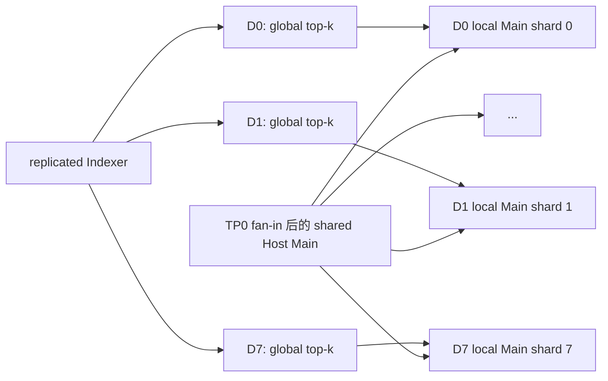
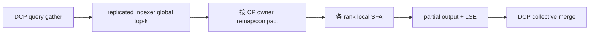
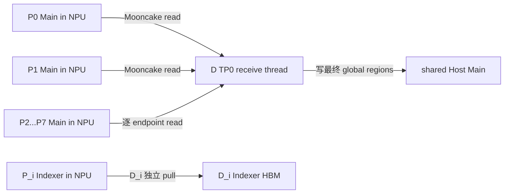
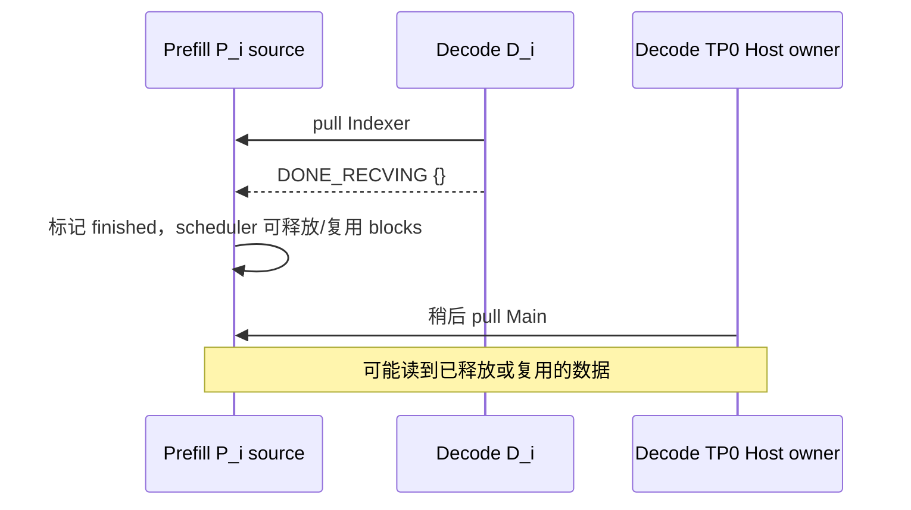

# Blockwise DCP offload 改动与联合验证方案

本文面向 vLLM Ascend 0.25rc1、GLM-5.2 W8A8、Mooncake 0.3.13，设计
`MooncakeConnector + dsa_pd_offload + fused KV offload` 的 DCP 数据完整性修复。

实验机已经确认 P8/D1 的短 prompt 是假阴：请求可以返回，但 Prefill 的全部 CP 分片没有传到
Decode。本文先建立可证明完整的 Host ingress 路径，再扩展对称 DCP、MTP 和图模式。

## 1. 已确认的现状

当前实现有四个直接相关的事实：

1. `DSAHostKVPool` 每个 DP group 只创建一段 shared segment；Decode TP0 是 owner，其他 TP ranks
   映射同一段 DRAM。
2. 只有 owner 建立 Main layout、注册 Main region 和执行 `MAIN_D2RH`；其他 ranks 只拉 Indexer。
3. `_dispatch_dsa_commands()` 为每个 Decode rank 只选择一个 Prefill leader endpoint。
4. P8/D1 的临时补丁把八个 source physical pages 和一个 destination physical page 取最小交集，
   实际只传一页。

所以目前不是“偶尔漏传”，而是协议、容量和完成条件都只表达了单 source、scale=1。

## 2. 首期范围与非目标

首期目标是建立以下 fail-closed 能力：

- P DCP=2/8、D DCP=1 时，Decode TP0 从全部 P CP sources 重组完整 Main Host view；
- Decode Indexer HBM 得到完整 replicated view；
- 少任意一页、一个 source 或一个 release ACK，请求都不能以 remote KV ready 进入 Decode；
- 保持当前 TP0 Host owner，不在首期引入多 D writer；
- 使用 eager、MTP 关建立 token 级正确性基线。

首期不承诺对称 DCP 的 attention 计算，也不承诺性能收益。P8/D8 还需要组合 DCP metadata 与
offload attention，不能由 connector 单独完成。

## 3. Host pool：从 scale=1 改为显式 ingress layout

### 3.1 当前容量错误

当前 Main layout 使用：

```text
[num_scheduler_blocks, decode_block_size, 1, width]
```

并强制 `tensor_blocks == kv_cache_config.num_blocks`，所以 local scale 恒为 1。P DCP=C 时，一个
scheduler logical block 在传输握手中展开为 C 个 kernel physical pages；P8/D1 因此出现
`remote_scale=8 / local_scale=1`。

### 3.2 新布局

把 Host pool 布局版本升级为 v2，并显式区分 logical block 与 ingress physical page：

```text
logical_blocks       = kv_cache_config.num_blocks
ingress_scale        = P_DCP * P_PCP          # 首期 PCP 固定为 1
physical_pages       = logical_blocks * ingress_scale
physical_page_bytes  = Prefill handshake 中单个 Main page 的字节数

physical_page(logical_block, source_cp_rank)
    = logical_block * ingress_scale + source_cp_rank
```

内存可以保持一段连续 shared segment，但 K/V view 改为 physical-page view：

```text
[physical_pages, physical_page_tokens, 1, width]
```

attention 所需的 global view 由相同底层存储 reshape/view 得到。禁止复制第二份完整 Main。

### 3.3 布局必须携带的字段

`DSAHostKVPoolLayout` 增加：

- `layout_version=2`；
- `logical_num_blocks`；
- `ingress_scale`；
- `physical_page_tokens` 和 `physical_page_bytes`；
- `cp_interleave_size`；
- `source_dcp_size/source_pcp_size`；
- `page_order=logical_block_then_cp_owner`；
- `layout_epoch`。

这些字段全部进入 fingerprint。启动阶段必须同时验证：

```text
pool.payload_bytes == memory_planner.planned_host_payload_bytes
pool.total_nbytes <= configured_dram_bytes
physical_pages * physical_page_bytes == logical_main_capacity_bytes
remote_main_scale == pool.ingress_scale
remote_main_page_bytes == pool.physical_page_bytes
```

alignment reserve 单独计入 `total_nbytes`。这些检查可以避免乘少一次造成缺页，也避免 planner 已按
全局 page 计费时再乘一次造成 8 倍重复申请。

### 3.4 Host pool 类的职责边界

`host_pool.py` 只负责：

- 连续内存申请、shared segment 创建/映射和 owner 注册；
- logical block + source shard 到 byte range 的确定性映射；
- layout fingerprint 和边界检查；
- 提供 Main ingress view 与 attention global view。

请求生命周期、coverage 和 source release 留在 connector，避免 Host pool 变成第二个 scheduler。

## 4. Indexer：不能继续复用 Main 的物理页规则

SFA DCP 的 Indexer 是 replicated global view，Main 是按 CP 分片的 source 数据。两者需要不同
planner。

P8/D1 首期有两种合法 Indexer layout，启动时只能选择其中一种：

1. **page packing**：Decode 一个 manager row 能容纳八个 P physical pages；planner 把 page 0…7
   写入 row 内不同 slot。
2. **expanded physical view**：Decode Indexer cache spec 分配 `logical_blocks * ingress_scale` 个
   physical pages，并使用与 replicated block table 一致的编号。

当前现场 `remote_scale=8 / local_scale=1 / token_scale=1` 两种条件都不满足，因此必须调整
ModelRunner 的 Indexer cache spec/allocation，不能在 connector 中截断。

建议优先复用 `AscendSFADCPMetadataBuilder` 的 replicated block table 编号，选择 expanded physical
view。这样 P8/D1 ingress 和后续 P8/D8 metadata 使用同一套物理编号。

此外不能仅凭名称假设每个 P rank 都持有完整 Indexer。P endpoint 必须在 handshake 中声明
`replication=FULL` 和 global coverage；只有验证等价后，才能用 `D_i <- P_i` 分散读取。若 P 端只
暴露 local shard，Indexer 也必须走多 source 聚合。

## 5. Connector 控制面

### 5.1 显式描述 CP source

当前 endpoint tuple 只按 Prefill TP rank排序。建议增加：

```python
RemoteEndpoint(
    tp_rank,
    dcp_rank,
    pcp_rank,
    remote_host,
    remote_port,
    remote_engine_id,
    layout_fingerprint,
    layout_epoch,
)

DsaSourceShard(
    component,          # INDEXER or MAIN
    source_endpoint,
    source_cp_rank,
    logical_block_ids,
    expected_pages,
    expected_bytes,
)
```

禁止用 `tp_rank == dcp_rank` 的偶然关系推导 CP owner。

### 5.2 一个请求的派发

在 P endpoints 已证明各自提供完整 replicated Indexer 时，首期 P8/D1：

```text
D_i: INDEXER_D2D <- P_i replicated Indexer source
D_0: MAIN_D2RH   <- P_0...P_7 Main shards
D_1...D_7: no Main transfer
```

TP0 的 Main fan-in 可以在一个 worker 线程内依次提交八个 Transfer Engine batch，也可以在
Mooncake 支持时并发提交；两种调度必须生成相同 coverage manifest。先做有界并发，避免一次创建
过多线程。

### 5.3 组件独立 planner

拆分 `_build_dsa_transfer_lists()`：

- `build_indexer_replica_plan()`：验证完整 global coverage，支持 packing 或 expanded view；
- `build_main_fanin_plan()`：按 `(logical_block, source_cp_rank)` 计算 Host destination page；
- `validate_plan_coverage()`：检查期望页集合等于实际页集合、无重复 destination byte range；
- `submit_transfer_plan()`：只负责调用 Mooncake，不再隐式推断布局。

任何 plan 都不得使用 `min(source, destination)`。源/目标数量不一致必须在提交前失败。

### 5.4 完成身份与屏障

`DsaLocalResult` 从“每 TP rank 一个结果”改为分片结果：

```text
(request, component, source_cp_rank, destination_tp_rank, layout_epoch)
```

P8/D1 的 expected set 为：

```text
8 × INDEXER results，destination 为 D0...D7
8 × MAIN results，destination 全部为 D TP0
```

每项携带 `planned_pages/completed_pages/planned_bytes/completed_bytes`。Scheduler 只有在 expected set
完全相等且缺口、重叠均为 0 时，才能设置 `finished_recving`。

## 6. Source lease、失败和取消

当前 receive 线程在每次 command 的 `finally` 中立即发送 DONE。TP0 Main 和 D_i Indexer 会同时读取
同一个 P_i endpoint；任一方先发 DONE，都可能让 P 提前释放源 KV。

`sfa_kv_offload.py` 现有注释称 PD pull 会由所有 TP ranks 写入 shared pool，但 connector 实际把
非 owner Main transfer list 置空。实现时应同步修正这段过期合同，避免后续维护者再次按错误假设
设计 release 和写入范围。

改成显式两阶段协议：

1. **TRANSFER**：所有 workers 传输并上报 coverage，不发送 DONE；
2. **COMMIT/ABORT**：D Scheduler 聚合全部结果后，命令 D TP0 coordinator 向每个 P endpoint 只发送
   一次 release，等待 ACK。

成功路径在全部 release ACK 后提交 remote KV ready。失败或取消路径：

- 标记本次 layout epoch 的 destination coverage 无效；
- 向所有已获取 lease 的 P endpoints 发送 ABORT/release；
- 清除 active command；
- 回退本地重算或返回明确失败；
- 绝不把旧 Host page 当成本次请求的有效页。

release 和结果都必须幂等，重复消息只能返回已有状态，不能重复释放或重复完成请求。

## 7. Offload manager 与 attention 边界

### 7.1 首期 P8/D1

Decode DCP=1 时，offload manager 继续使用完整 Host view。需要增加：

- global scheduler block table 到 Host physical page table 的展开；
- `slot_mapping` 到 v2 Host layout 的转换；
- TP0 新 Decode token 写入 global Host slot；
- block 复用时递增/校验 layout epoch，防止读取旧页。

fused selection 只能在 connector coverage commit 后读取对应 blocks。

### 7.2 对称 DCP

当前 `AscendSFABackend` 在 offload enabled 时直接选择 offload builder/impl，覆盖原生
`AscendSFADCPMetadataBuilder/Impl`。因此 P8/D8 需要新增组合实现，而不是调整选择优先级：

```text
AscendSFADCPKVOffloadMetadataBuilder
AscendSFADCPKVOffloadImpl
```

组合实现至少复用原生 DCP 的：

- replicated Indexer block table/slot mapping；
- DCP query gather；
- global top-k 到 local Main 的 remap；
- partial output + LSE merge。

D 侧真 DCP 的缓存和计算关系为：





TP0 owner 约束的是 **Prefill Main 的写入与注册**，不要求 DCP attention 读取完整 Main。fan-in
完成后，各 D rank 可以在同一 shared segment 上构造只覆盖本 owner shard 的 local view。

Decode 新 token 的 Main 写入还要明确 writer 合同：若各 DCP rank 生成的当前 K/V 已证明等价，TP0
可继续按 global slot 单写；否则必须由 token owner rank 写自己的不重叠 shard，并升级为多 writer
注册/屏障。实现前先在实验机比较各 rank 当前 K/V 的 shape、dtype 和内容一致性，只上传一致性
布尔值，不能直接沿用“TP 间天然 replicated”的旧注释。

当前 fused overlap Main 算子只提供最终 attention output，缺少 partial output + LSE 合同。因此有
两个评审选项：

- **完整 Host compatibility mode**：每 rank 读取完整 Main，不做 local top-k remap；先用于验证组合
  metadata，但必须逐 token 对齐，不能宣称 DCP 扩展收益。
- **真 DCP mode**：每 rank 只取本地 Main shard，扩展 fused 算子返回 partial output/LSE，或先
  all-gather selected KV 后做一次完整 SFA。

首期 connector 合并不依赖这项选择；对称 DCP 测试必须等组合实现确定后再开始。

### 7.3 MTP 和图模式

MTP=3 时 `max_num_topk_rows`、selection/membership、current KV descriptor 和 Host slot mapping 都要按
最大 draft width 在 capture 前静态分配。验证要求：

- accepted token 写入正确 Host global slots；
- rejected draft rows 不进入有效 coverage；
- target/draft 使用相同 layout epoch；
- graph runtime 不创建 segment、不扩容、不改变 fingerprint。

## 8. 文件级修改范围

| 文件 | 首期改动 |
| --- | --- |
| `host_pool.py` | layout v2、ingress scale、page mapping、双 view、fingerprint v2 |
| `model_runner_v1.py` | 启动时按 P CP topology 规划 Main/Indexer capacity，绑定 v2 pool |
| `mooncake_dsa_metadata.py` | CP-aware endpoint、source shard、coverage result、release command |
| `mooncake_connector.py` | 多 source Main fan-in、组件 planner、coverage barrier、两阶段 release |
| `kv_offload_decode_manager.py` | global/physical block table、v2 slot mapping、epoch/validity gate |
| `sfa_v1.py` | 选择新的 offload+DCP 组合 backend |
| `sfa_kv_offload.py` | 组合 metadata/impl、MTP/graph 静态 buffer |
| `context_parallel/sfa_cp.py` | 抽取可复用的 replicated view、remap 和 LSE merge helper |

首期提交不应同时修改 fused kernel；connector 数据完整性与 attention DCP 分成独立 commits。

## 9. 联合验证门禁

### 9.1 本地 CPU UT

1. C=2/8 下 logical block + CP owner 到 physical page 的双射；
2. Main plan 对全部 source pages 完整覆盖且 destination byte ranges 不重叠；
3. Indexer expanded/packing 两种合法布局与所有非法组合；
4. 少一个 source、重复 destination、错误 epoch、错误 fingerprint 全部 fail closed；
5. transfer 成功但 release 失败时不得报告 remote KV ready；
6. 取消、重复 result、重复 release 的幂等性。

### 9.2 实验机阶梯

| 阶段 | 配方 | 通过条件 |
| --- | --- | --- |
| A0 | P1/D1，eager，MTP0 | 现有基线保持 token 级一致 |
| A1 | P2/D1，eager，MTP0 | 两个 Main sources、完整 Indexer；跨 1/2/3 CP pages |
| A2 | P8/D1，eager，MTP0 | 八 source coverage=100%，长 prompt 跨 8/9/16 pages |
| A3 | P8/D1，eager，MTP P1/D3 | target/draft epoch 一致，接受/拒绝后 Host coverage 正确 |
| A4 | P8/D1，FULL_DECODE_ONLY | capture 前容量固定，runtime 无分配 |
| B1 | P2/D2，再 P8/D8，eager，MTP0 | 组合 DCP backend 与 DCP1 基线逐 token 对齐 |
| B2 | P8/D8，MTP3，再开图 | MTP、图、并发和长稳逐项放开 |

### 9.3 必须加入的负向用例

故意丢弃一个 Main shard 或一个 Indexer page。即使使用短 prompt，系统也必须在 coverage gate 失败，
不能依靠输出文本发现问题。这是防止再次出现假阴的核心回归测试。

### 9.4 只外传脱敏证据

实验机上传以下计数与布尔值，不上传 prompt、生成文本、token IDs、block IDs、地址或完整日志：

- 配方、commit、dirty、layout fingerprint 是否一致；
- 每 component/source rank 的 planned/completed page 和 byte 数；
- coverage expected/unique/missing/overlap；
- source release expected/ACK 数；
- 与基线首次 token 分歧位置、匹配数/总数；
- MTP candidate/accepted/rejected/fallback 汇总；
- graph capture 完成、runtime allocation count；
- TTFT/TPOT 分位数只在正确性门禁通过后记录。

## 10. 建议的提交拆分

1. `refactor(kv-transfer)`: 增加 CP-aware metadata 和纯函数 page mapping；
2. `feat(kv-offload)`: Host pool layout v2 与内存规划；
3. `fix(kv-transfer)`: TP0 multi-source Main +完整 Indexer planner；
4. `fix(kv-transfer)`: coverage barrier、lease 和 release/abort；
5. `test(kv-transfer)`: P2/P8 fan-in、缺页和取消回归；
6. `feat(attention)`: offload+DCP 组合 backend；
7. `test(attention)`: DCP、MTP、图和精度阶梯。

每个提交都保留 guard，直到它对应的 capability 与回归测试同时存在。实验机可在 feature branch 上
临时解除 guard，但不能把解除 guard 当成功标准。

## 11. 2026-09-01 实验补丁 `54ea583e7` 评审

远端实际状态需要先说清楚：`mte_fuse_0723_mooncake_test_0827_add_block` 仍停在
`d1bf0bad2`；新补丁 `54ea583e7` 位于 `exp/rebase25-add-block-20260831`。因此实验时必须记录并核对
commit，不能只写“0827 add block”。该提交的 Main 修复方向是对的：Decode TP0 遍历 Prefill CP
endpoints，把各 CP-local Main page 按全局 token 起点写入 shared Host view。纯映射函数在 64、128、
256 token 三组参数下均通过本地 smoke，说明映射公式本身没有把 128 写死。

### 11.1 当前结论：暂不进入正确性实验

这版可以作为代码评审样本，尚不能作为 P8/D1 或 P8/D8 的正确性实验基线。以下问题会继续产生
“请求完成但 KV 不完整”的假成功：

1. **Indexer 仍然截断。** `_build_dsa_transfer_lists()` 对非 page-packing 路径使用
   `min(len(source_physical), len(destination_physical))`，P8/D1 的 remote scale=8、local scale=1
   只复制重叠前缀。它必须按明确的 replicated/partitioned layout 生成完整 destination coverage，无法
   表达时应 fail closed。
2. **Main 缺页被静默跳过。** `_build_dsa_unified_main_lists()` 在 `dest_index` 超过 reservation 时
   `continue`。必须把 expected page/byte range 和实际 unique range 比较；少一页、越界或重叠都返回
   `TRANSFER_FAILED`，不能只检查 `n_written > 0`。
3. **多 source 生命周期不完整。** Main gather 读取 P0…P7，但 `_execute_dsa_receive()` 的 `finally`
   只向最初的 `remote_endpoint` 发送 `DONE_RECVING`。必须在 Indexer 和 Main 均完成并通过 coverage
   barrier 后，对所有实际使用的 endpoint 逐一 release 并等 ACK；失败/取消也要对已取得 lease 的
   endpoint 做幂等 abort/release。
4. **Main remote stride 被丢弃。** 新 builder 直接使用 `remote_base + source_id * remote_len`，却
   `del remote_strides`。应使用握手提供的 `remote_stride`，或显式验证 `remote_stride == remote_len`；
   否则带 padding/alignment 的布局会读错地址。
5. **D=8 读取逻辑尚未实现。** 当前只移除了 connector 和 `sfa_kv_offload` 的启动 guard。
   fused overlap 仍直接消费原始 `attn_metadata.block_table`，manager 也声明复用原始
   block table/slot mapping；`cp_local_page_to_unified_index()` 没有接入任何读取或写回路径。因此
   P8/D8 不能开始数据正确性实验。
6. **短 prompt 语义不应靠 skip。** 每个 CP rank 的有效页数必须由 token coverage/valid length
   决定，而不是靠 destination 越界跳过。负向用例必须故意丢一片并确认系统失败。

### 11.2 `128` 的参数契约

`unified_host_slot()` 使用 `p_kernel_tokens` 和 `d_block_tokens` 参数，数值 128 只出现在当前 GLM-5.2
实验配置、文档示例和 UT fixture 中，并非公式内的常量。`d_block_tokens` 来自
`_pending_runner_host_pool.layout.block_size`，这部分是运行时值。

但当前实现仍有一项不安全的**隐式推断**：`p_kernel_tokens` 由 remote page bytes、Host block bytes
和 Host block tokens 的比例推出来。字节比例只能证明容量，不能完整证明 token geometry、dtype、
layout 或 CP interleave 语义。握手应显式携带并校验：

- `page_tokens`（即 Prefill kernel page token 数）；
- `host_block_tokens`；
- dtype、每 token bytes、stride、layout version/fingerprint；
- `remote_dcp_size`、`remote_pcp_size` 和 CP rank 到 endpoint 的映射。

因此回答是：**公式没有硬编码 128，但协议仍把 128 隐含在当前配置和 byte-ratio 推断里，尚未做到
真正的配置无关。** UT 至少增加 64/128/256 参数化、stride≠len、reservation 少一页、重复 destination
和缺 source 的失败用例。

### 11.3 可进入实验的最小补丁范围

先只开放 P8/D1、eager、MTP0，并保留 D>1 guard：

1. 显式 handshake token geometry 与 layout fingerprint；
2. Main 使用 remote stride，建立 expected/unique/missing/overlap coverage；
3. 修复 Indexer 完整 planner，删除 `min()` 成功路径；
4. 为所有 P endpoints 实现 lease、barrier、release/ACK；
5. 加入缺 shard 必失败的 UT/诊断注入；
6. 通过 P1/D1 回归后，按 A1→A2 做长 prompt token 级对齐。

P8/D8 需要另一个提交接入 DCP-aware block table、slot mapping、新 token writer contract 和 attention
组合逻辑，不能通过去 guard 与 P8/D1 同批验证。MTP3 与图模式继续位于 A3/A4，等待 eager MTP0 的
coverage 和 token 对齐通过后再开。

## 12. 2026-09-02：实验现象、h0–h7 与状态机复核

实验侧反馈 `54ea583e7` 已通过 128/512/2k prompt 冒烟，MTP3 的 draft accept 平均约 30%–40%，
第二位置约 0.5。该结果证明当前低并发配方能够完成服务和请求，也说明 Main 多 source gather 至少覆盖
了这些样本；它还不能覆盖 source block 提前复用、缺页 fail-open 和 D=8 reader 等并发/负向风险。

### 12.1 `54ea583e7` 的改动范围

生产代码共四个文件：

| 文件 | 函数或接口 | 实际作用 |
| --- | --- | --- |
| `mooncake_dsa_unified_view.py`（新增） | `prefill_rank_for_cp_rank()` | CP rank → Prefill endpoint；当前只允许 PCP=1 |
| 同上 | `unified_host_slot()` | `(source page, CP rank)` → `(Host destination index, token offset)` |
| 同上 | `tokens_per_page()` | 由 page/Host bytes 比例推断 Prefill page tokens |
| 同上 | `cp_local_page_to_unified_index()` | DCP-local block → unified index；当前没有接入 reader |
| `mooncake_dsa_metadata.py` | `RemoteSource.remote_dcp_size/remote_pcp_size` | 把 Prefill CP topology 带到 worker |
| `mooncake_connector.py` | `_dsa_load_remote_handshake()` | 按 endpoint 读取并缓存 base/stride/scale/length/session |
| 同上 | `_build_dsa_unified_main_lists()` | 为一个 P CP rank 生成 Main D2RH 地址列表 |
| 同上 | `_dsa_gather_main_unified_view()` | D TP0 遍历 P CP endpoints 并执行 Main pull |
| 同上 | `_execute_dsa_receive()` | Indexer 完成后，Host owner 进入 Main gather |
| 同上 | `_build_dsa_transfer_lists()` | 放宽非对称 scale；当前仍以 `min()` 截断 Indexer |
| 同上 | `_MooncakeDsaDecodeScheduler.get_num_new_matched_tokens()` | 构造带 remote CP size 的 `RemoteSource` |
| 同上 | `MooncakeConnector.__init__()` | 把 DCP/PCP 硬拒绝改成 warning |
| 同上 | `MooncakeConnectorWorker.register_kv_caches()` 相关初始化 | 把 runner Host pool block tokens 传给 receive thread |
| `sfa_kv_offload.py` | `AscendSFAKVOffloadImpl.__init__()` | 删除普通 `enable_cp()` 拒绝，仍拒 `enable_dsa_cp` |

另外修改两个 UT 文件，增加 metadata 与纯映射测试；六个文件属于实验文档/发布脚本。没有修改 Host
pool allocator、KV offload manager、fused overlap block-table builder 或 Mooncake 传输引擎接口。

### 12.2 h0–h7 到底是什么

h0–h7 是设计图使用的**全局顺序目标区域**，不是源码对象名，也不是只记录关系、不搬数据的映射表。
planner 先算映射，Mooncake 随后把字节直接写进这些目标区域；fan-in 本身就是最终聚合，不存在“先写
h0–h7，再做一次 memcpy 聚合”的下一步。

P8/D1、Prefill page=128 token、Host block=128 token 时，对 local source page `j`：

```text
global page index = j * 8 + cp_rank
P0.page[j] -> destination_block_ids[j*8+0]   # 图中的 h0（j=0）
P1.page[j] -> destination_block_ids[j*8+1]   # 图中的 h1
...
P7.page[j] -> destination_block_ids[j*8+7]   # 图中的 h7
```

这里的 h0–h7 是最终 Host pages，但真实物理 block ID 取自 allocator，未必连续。Decode DCP1 的
`block_table` 按全局 token 顺序直接读这些 pages。

若未来 P8/D8 的 Host scheduler row 是 1024 token，则 h0–h7 更准确地表示同一个 Host row 的八个
128-token slice：`H[j] + rank*128*token_bytes`。它们不再是八个独立 Host blocks。当前代码能生成这种
写地址，但 D 侧 reader 还没有消费 `cp_local_page_to_unified_index()`，所以不能据此认定 P8/D8 已闭环。

### 12.3 当前真实数据面：多 source、单 Host writer

当前不是 P ranks 主动并行写 D Host：



`_dsa_main_owner` 保证只有 Host pool owner（当前 TP0）写 Main，且
`_dsa_gather_main_unified_view()` 的 Python loop 逐 CP rank 调用同步 read。因此当前没有 P0～P7 对
Host 同一地址的并发写竞争。需要保留的风险是地址规划的缺页/重叠，以及 P source 的生命周期。

### 12.4 原状态机能保证什么

| flag/state | 能保证 | 不能保证 |
| --- | --- | --- |
| `command_emitted` | Scheduler 对请求只发一次 command | 数据完整、endpoint lease |
| `_dsa_active_commands` | 单 worker 不重复启动同一 command | 跨 worker/跨 source 的原子提交 |
| `_dsa_main_owner` | shared Host Main 单 writer | Main source 在读取前不被释放 |
| `batch_transfer_sync_read()` 返回 | 本批传输调用已结束 | 所有 expected pages 都被规划 |
| `DsaLocalResult(RECEIVE_COMPLETE)` | 本 rank 没看到 transfer API 失败 | coverage=100%、release 完整 |
| `results_by_rank == expected_tp_ranks` | D 所有 TP worker 都返回 | 每个 P endpoint 的 Indexer+Main 都完成 |
| `finished_recving` | Scheduler 可解除 remote-KV 等待 | P source 生命周期安全 |
| P `delayed_free_requests/reqs_to_process` | 收到 DONE 前延迟释放本 rank blocks | 一个 DONE 是否覆盖全部 consumers |
| `port_send_num` | 旧路径在携带计数字典时等待多个 DONE | DSA 当前传 `{}`，此计数逻辑未启用 |
| DONE 的 ACK | P endpoint 已处理 DONE | D 已验证全局 coverage 或提交 Host epoch |

D 侧的基本时序是可用的：TP0 的同步 Main gather 返回后才生成 local result，Scheduler 等到所有 Decode
TP results 后才设置 `finished_recving`，因此正常路径中 Decode 不应在 TP0 fan-in 尚未返回时读取 Host。
`_dsa_main_owner` 也避免了 Host 多 writer。

原机制**不能保证 P source 生命周期**。对 P_i（i>0），当前可能发生：



单请求冒烟通常不会立刻复用这些 blocks，所以 128/512/2k 都通过并不矛盾。要关闭该风险，不能让
各 D_i 在 Indexer 完成后直接释放 P_i。应为每个 endpoint 建立 expected component set：
`{INDEXER(P_i→D_i), MAIN(P_i→D0)}`；全部 component 完成、全局 coverage 校验通过后，再由一个
coordinator 向每个 P_i 发送一次 release 并等待 ACK。失败/取消对已取得 lease 的 endpoints 做幂等
abort/release。

如果未来改成 P0～P7 真正并行 push Host，则还需增加 destination range ownership、request/layout
epoch、每 shard completion bitmap、memory visibility barrier 和一次性的 `COMMIT_READY`。只有
`expected == completed_unique`、无 missing/overlap 且 epoch 一致时，reader 才能从 `RECEIVING` 转为
`READABLE`。

### 12.5 MTP3 接受率的解释

vLLM 的 per-position acceptance 是以所有 draft rounds 为分母的**无条件概率**。后一个 draft token
被接受的前提是前面的 token 都接受，所以曲线天然单调下降。若 `A0/A1/A2` 是三个位置的接受率：

```text
mean accepted draft tokens = A0 + A1 + A2
mean acceptance length     = 1 + A0 + A1 + A2
reported draft accept      = (A0 + A1 + A2) / 3
conditional position 2     = A1 / A0，而不是 A1
```

因此平均 30%–40% 对 MTP3 对应每步平均接受 0.9–1.2 个 draft，加上 target base token，mean
acceptance length 约 1.9–2.2。第二位置约 0.5 本身不异常；要结合第一位置计算条件概率。此前同分支
P8/D1+MTP3 的记录是 draft accept 21.1%、mean length 1.63，当前数据反而有所提高。

接受率受 prompt 分布、sampling 参数、并发、W8A8 量化与 MTP draft head 质量影响。它不是 KV
正确性的单独判据：verifier 会拒绝不匹配 draft，低接受率仍可输出正确 target token；反过来，draft
和 target 若共同读取错误 KV，也可能保持一定接受率。

验证是否由 blockwise/Host KV 引起，应在实验机固定模型、prompt、seed、temperature 和并发，做：

1. 本地/不走 PD offload 的 MTP3 基线；
2. P1/D1 blockwise MTP3；
3. P8/D1 blockwise MTP3；
4. 对三组记录 `A0/A1/A2`、mean acceptance length、TPOT，并在机内逐 token 对齐 MTP-off target；
5. 按 prefix 跨 128-page 边界与并发度分桶。如果只有 P8/D1 在边界或并发升高后坍塌，才优先怀疑
   Host mapping/source reuse；若三组曲线接近，则接受率主要是模型与 workload 属性。

状态机风险的专项实验应使用至少两个并发请求，并在 D_i DONE 后、D0 拉该 rank Main 前注入延迟，
同时迫使 P allocator 复用旧 blocks。修复前该用例应能暴露 checksum/epoch 不一致；修复后必须稳定
fail closed 或完整通过。
