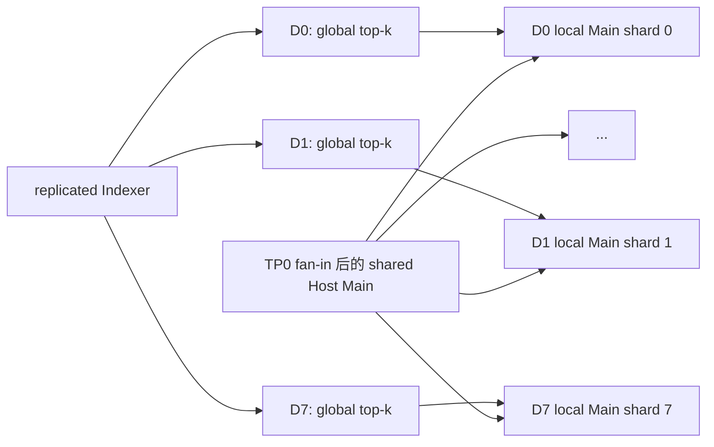
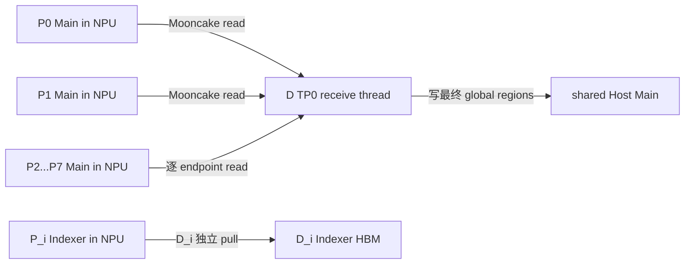
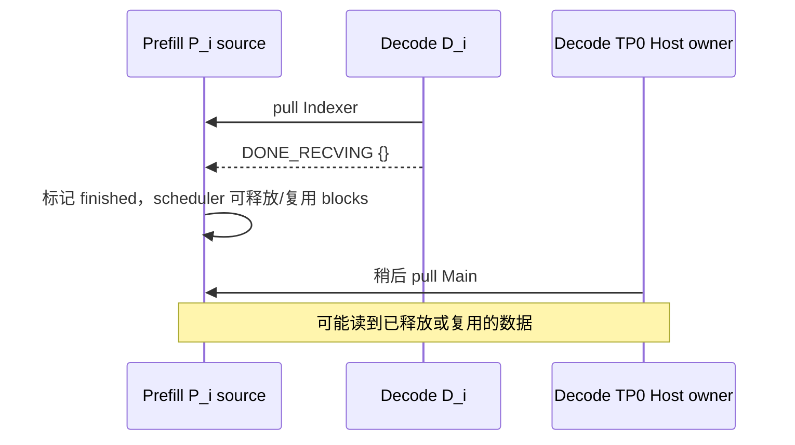
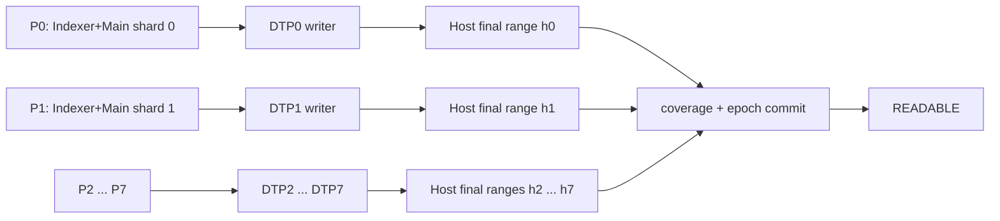
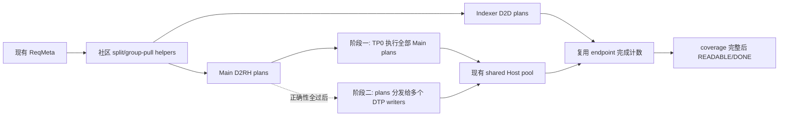

# Blockwise DCP offload 改动与联合验证方案

本文面向 vLLM Ascend 0.25rc1、GLM-5.2 W8A8、Mooncake 0.3.13，设计
`MooncakeConnector + dsa_pd_offload + fused KV offload` 的 DCP 数据完整性修复。

历史实验曾确认 P8/D1 的短 prompt 存在假阴；最新实验补丁已经通过 TP0 multi-source gather 和地址
映射修复该主路径。本文区分当前必要的小范围修复、待验证风险和正确性通过后的性能方案。

## 1. 已确认的现状

修复前基线有四个直接相关的事实：

1. `DSAHostKVPool` 每个 DP group 只创建一段 shared segment；Decode TP0 是 owner，其他 TP ranks
   映射同一段 DRAM。
2. 只有 owner 建立 Main layout、注册 Main region 和执行 `MAIN_D2RH`；其他 ranks 只拉 Indexer。
3. `_dispatch_dsa_commands()` 为每个 Decode rank 只选择一个 Prefill leader endpoint。
4. P8/D1 的临时补丁把八个 source physical pages 和一个 destination physical page 取最小交集，
   实际只传一页。

问题核心是 source endpoint 选择和目标地址映射只覆盖了单 source；现有 Host pool 容量与 view 本身
不需要重写。

## 2. 首期范围与非目标

首期目标是建立以下 fail-closed 能力：

- P DCP=2/8、D DCP=1 时，Decode TP0 从全部 P CP sources 重组完整 Main Host view；
- Decode Indexer HBM 得到完整 replicated view；
- TP0 的全部 source transfer 返回后，请求才能以 remote KV ready 进入 Decode；
- 保持当前 TP0 Host owner，不在首期引入多 D writer；
- 使用 eager、MTP 关建立 token 级正确性基线。

首期不承诺对称 DCP 的 attention 计算，也不承诺性能收益。P8/D8 还需要组合 DCP metadata 与
offload attention，不能由 connector 单独完成。

## 3. Host pool：保持现有布局，只补传输地址映射

### 3.1 当前问题是 source shard 到目标地址的映射

当前 Main layout 使用：

```text
[num_scheduler_blocks, decode_block_size, 1, width]
```

这个布局本身可以容纳 Decode attention 需要的完整 global Main KV，无需把 `num_blocks` 扩大 C 倍。
P DCP=C 时，完整 Main KV 分布在 C 个 Prefill endpoints；每个 endpoint 暴露一个 CP-local shard。
旧路径的问题是只从一个 endpoint 拉取，或把 source block id 直接当成 Decode Host block id，缺少
`(source_cp_rank, source_block_index) → (host_block_id, token_offset)` 的映射。握手中的
`remote_scale/local_scale` 差异用于推导传输粒度，不能直接解释为 Host pool 容量少了 C 倍。

### 3.2 最小修改方案

**不新建 v2 Host pool，不改变现有 shared segment 的申请、K/V shape 和 attention view。** Prefill
DCP shard 仍写入 Decode 已经分配好的 Host block，只在 connector 构造 Mooncake transfer list 时计算
目标 block 和 block 内 token offset：

```text
source shard: (source_cp_rank, source_block_index, source_page_bytes)
destination:  (decode_host_block_id, token_offset_in_block, copy_bytes)

destination_address = host_layer_base
                    + decode_host_block_id * host_block_stride
                    + token_offset_in_block * bytes_per_token
```

这正是实验补丁 `54ea583e7` 中 `unified_host_slot()` 与
`_build_dsa_unified_main_lists()` 的方向：P0～P7 的 CP-local Main pages 被拼到现有 Decode Host block
的不同 byte ranges，attention 仍读取原来的完整 Host view。它不额外申请一份 Main，也不要求
model runner 改变内存规划。

### 3.3 connector 侧需要校验的现有参数

无需扩展 `DSAHostKVPoolLayout`。connector 从已有 Host tensor/layout 和 Prefill handshake 取得下面的
值，并在构造地址列表时校验：

```text
host_block_tokens > 0
host_block_stride >= host_block_tokens * bytes_per_token
source_page_bytes % bytes_per_token == 0
source_page_tokens <= host_block_tokens
token_offset + source_page_tokens <= host_block_tokens
所有 source shard 的目标 byte ranges 不越界、不重叠
```

这些是传输 plan 的正确性检查，不是新内存布局协议。128 也不应硬编码；它应由
`source_page_bytes / bytes_per_token` 或现有 block-size metadata 推导。

### 3.4 Host pool 类的职责边界

`host_pool.py` 继续只负责：

- 连续内存申请、shared segment 创建/映射和 owner 注册；
- 现有 per-layer K/V view 和地址/stride；
- 现有生命周期与 Mooncake registration。

CP shard 到 Host byte range 的映射放在 connector 的纯函数/helper 中，避免 Host pool 感知 Prefill
DCP/PCP topology，也避免影响 model runner 和上游 KV cache 接口。

这里的“只补 connector 映射”直接适用于 P8/D1。对称 P8/D8 下，scheduler block 覆盖的是 DCP
virtual span，而当前 Host row 仍是 128-token physical page；两者不能继续共用同一个 block-id list。
第 14 节根据最新错误栈说明必须补的最小 block adapter。它仍不要求重写 Host pool 类。

请求生命周期、coverage 和 source release 留在 connector，避免 Host pool 变成第二个 scheduler。

## 4. Indexer：先确认复制语义，不改内存规划

SFA DCP 的 Indexer 通常是 replicated global view，而 Main 是 CP-local shard。若实验代码和 checksum
确认各 P rank 的 Indexer 完整且等价，Decode D_i 继续从 P_i 拉到现有 Indexer buffer 即可，不需要
expanded cache、不需要修改 ModelRunner allocation，也不需要把 Main 的 CP 拼接规则套到 Indexer。

connector 只需在握手/调试校验中确认 Indexer 的 shape、page bytes 和 replication 语义；如果现有
metadata 暂时不能声明 `replication=FULL`，首期可以用内部断言或测试 checksum 证明，没必要为此先
扩展公共协议。只有确认 P 端实际暴露的是 local shard，才需要另行设计 Indexer 聚合，不能预先按该
假设扩大改动范围。

## 5. Connector 控制面

### 5.1 显式描述 CP source

当前 endpoint tuple 只按 Prefill TP rank排序。建议增加：

```python
RemoteEndpoint(
    tp_rank,
    dcp_rank,
    pcp_rank,
    remote_host,
    remote_port,
    remote_engine_id,
    layout_fingerprint,
    layout_epoch,
)

DsaSourceShard(
    component,          # INDEXER or MAIN
    source_endpoint,
    source_cp_rank,
    logical_block_ids,
    expected_pages,
    expected_bytes,
)
```

禁止用 `tp_rank == dcp_rank` 的偶然关系推导 CP owner。

### 5.2 一个请求的派发

在 P endpoints 已证明各自提供完整 replicated Indexer 时，首期 P8/D1：

```text
D_i: INDEXER_D2D <- P_i replicated Indexer source
D_0: MAIN_D2RH   <- P_0...P_7 Main shards
D_1...D_7: no Main transfer
```

TP0 的 Main fan-in 可以在一个 worker 线程内依次提交八个 Transfer Engine batch，也可以在
Mooncake 支持时并发提交；两种调度必须生成相同 coverage manifest。先做有界并发，避免一次创建
过多线程。

### 5.3 组件独立 planner

拆分 `_build_dsa_transfer_lists()`：

- `build_indexer_replica_plan()`：验证完整 global coverage，支持 packing 或 expanded view；
- `build_main_fanin_plan()`：按 `(logical_block, source_cp_rank)` 计算 Host destination page；
- `validate_plan_coverage()`：检查期望页集合等于实际页集合、无重复 destination byte range；
- `submit_transfer_plan()`：只负责调用 Mooncake，不再隐式推断布局。

任何 plan 都不得使用 `min(source, destination)`。源/目标数量不一致必须在提交前失败。

### 5.4 完成身份与屏障

`DsaLocalResult` 从“每 TP rank 一个结果”改为分片结果：

```text
(request, component, source_cp_rank, destination_tp_rank, layout_epoch)
```

P8/D1 的 expected set 为：

```text
8 × INDEXER results，destination 为 D0...D7
8 × MAIN results，destination 全部为 D TP0
```

每项携带 `planned_pages/completed_pages/planned_bytes/completed_bytes`。Scheduler 只有在 expected set
完全相等且缺口、重叠均为 0 时，才能设置 `finished_recving`。

## 6. Source lease、失败和取消

当前 receive 线程在每次 command 的 `finally` 中立即发送 DONE。TP0 Main 和 D_i Indexer 会同时读取
同一个 P_i endpoint；任一方先发 DONE，都可能让 P 提前释放源 KV。

`sfa_kv_offload.py` 现有注释称 PD pull 会由所有 TP ranks 写入 shared pool，但 connector 实际把
非 owner Main transfer list 置空。实现时应同步修正这段过期合同，避免后续维护者再次按错误假设
设计 release 和写入范围。

改成显式两阶段协议：

1. **TRANSFER**：所有 workers 传输并上报 coverage，不发送 DONE；
2. **COMMIT/ABORT**：D Scheduler 聚合全部结果后，命令 D TP0 coordinator 向每个 P endpoint 只发送
   一次 release，等待 ACK。

成功路径在全部 release ACK 后提交 remote KV ready。失败或取消路径：

- 标记本次 layout epoch 的 destination coverage 无效；
- 向所有已获取 lease 的 P endpoints 发送 ABORT/release；
- 清除 active command；
- 回退本地重算或返回明确失败；
- 绝不把旧 Host page 当成本次请求的有效页。

release 和结果都必须幂等，重复消息只能返回已有状态，不能重复释放或重复完成请求。

## 7. Offload manager 与 attention 边界

### 7.1 首期 P8/D1

Decode DCP=1 时，offload manager 继续使用完整 Host view。需要增加：

- Prefill source shard 到现有 Host block 内 byte range 的映射；
- 保持 Decode 原有 `block_table` 和 `slot_mapping` 口径；
- TP0 新 Decode token 写入 global Host slot；
- block 复用时递增/校验 layout epoch，防止读取旧页。

fused selection 只能在 connector coverage commit 后读取对应 blocks。

### 7.2 对称 DCP

当前 `AscendSFABackend` 在 offload enabled 时直接选择 offload builder/impl，覆盖原生
`AscendSFADCPMetadataBuilder/Impl`。因此 P8/D8 需要新增组合实现，而不是调整选择优先级：

```text
AscendSFADCPKVOffloadMetadataBuilder
AscendSFADCPKVOffloadImpl
```

组合实现至少复用原生 DCP 的：

- replicated Indexer block table/slot mapping；
- DCP query gather；
- global top-k 到 local Main 的 remap；
- partial output + LSE merge。

D 侧真 DCP 的缓存和计算关系为：




TP0 owner 约束的是 **Prefill Main 的写入与注册**，不要求 DCP attention 读取完整 Main。fan-in
完成后，各 D rank 可以在同一 shared segment 上构造只覆盖本 owner shard 的 local view。

Decode 新 token 的 Main 写入还要明确 writer 合同：若各 DCP rank 生成的当前 K/V 已证明等价，TP0
可继续按 global slot 单写；否则必须由 token owner rank 写自己的不重叠 shard，并升级为多 writer
注册/屏障。实现前先在实验机比较各 rank 当前 K/V 的 shape、dtype 和内容一致性，只上传一致性
布尔值，不能直接沿用“TP 间天然 replicated”的旧注释。

当前 fused overlap Main 算子只提供最终 attention output，缺少 partial output + LSE 合同。因此有
两个评审选项：

- **完整 Host compatibility mode**：每 rank 读取完整 Main，不做 local top-k remap；先用于验证组合
  metadata，但必须逐 token 对齐，不能宣称 DCP 扩展收益。
- **真 DCP mode**：每 rank 只取本地 Main shard，扩展 fused 算子返回 partial output/LSE，或先
  all-gather selected KV 后做一次完整 SFA。

首期 connector 合并不依赖这项选择；对称 DCP 测试必须等组合实现确定后再开始。

### 7.3 MTP 和图模式

MTP=3 时 `max_num_topk_rows`、selection/membership、current KV descriptor 和 Host slot mapping 都要按
最大 draft width 在 capture 前静态分配。验证要求：

- accepted token 写入正确 Host global slots；
- rejected draft rows 不进入有效 coverage；
- target/draft 使用相同 layout epoch；
- graph runtime 不创建 segment、不扩容、不改变 fingerprint。

## 8. 文件级修改范围

| 文件 | 首期改动 |
| --- | --- |
| `host_pool.py` | 首期不改布局；仅复用现有 base/stride/shape |
| `model_runner_v1.py` | 首期不改 Host 内存规划 |
| `mooncake_dsa_metadata.py` | CP-aware endpoint、source shard、coverage result、release command |
| `mooncake_connector.py` | 多 source Main fan-in、组件 planner、coverage barrier、两阶段 release |
| `kv_offload_decode_manager.py` | 首期尽量不改；继续消费原有完整 Host view |
| `sfa_v1.py` | 选择新的 offload+DCP 组合 backend |
| `sfa_kv_offload.py` | 组合 metadata/impl、MTP/graph 静态 buffer |
| `context_parallel/sfa_cp.py` | 抽取可复用的 replicated view、remap 和 LSE merge helper |

首期提交不应同时修改 fused kernel；connector 数据完整性与 attention DCP 分成独立 commits。

## 9. 联合验证门禁

### 9.1 本地 CPU UT

1. C=2/8 下 logical block + CP owner 到 physical page 的双射；
2. Main plan 对全部 source pages 完整覆盖且 destination byte ranges 不重叠；
3. Indexer expanded/packing 两种合法布局与所有非法组合；
4. 少一个 source、重复 destination、错误 epoch、错误 fingerprint 全部 fail closed；
5. transfer 成功但 release 失败时不得报告 remote KV ready；
6. 取消、重复 result、重复 release 的幂等性。

### 9.2 实验机阶梯

| 阶段 | 配方 | 通过条件 |
| --- | --- | --- |
| A0 | P1/D1，eager，MTP0 | 现有基线保持 token 级一致 |
| A1 | P2/D1，eager，MTP0 | 两个 Main sources、完整 Indexer；跨 1/2/3 CP pages |
| A2 | P8/D1，eager，MTP0 | 八 source coverage=100%，长 prompt 跨 8/9/16 pages |
| A3 | P8/D1，eager，MTP P1/D3 | target/draft epoch 一致，接受/拒绝后 Host coverage 正确 |
| A4 | P8/D1，FULL_DECODE_ONLY | capture 前容量固定，runtime 无分配 |
| B1 | P2/D2，再 P8/D8，eager，MTP0 | 组合 DCP backend 与 DCP1 基线逐 token 对齐 |
| B2 | P8/D8，MTP3，再开图 | MTP、图、并发和长稳逐项放开 |

### 9.3 必须加入的负向用例

故意丢弃一个 Main shard 或一个 Indexer page。即使使用短 prompt，系统也必须在 coverage gate 失败，
不能依靠输出文本发现问题。这是防止再次出现假阴的核心回归测试。

### 9.4 只外传脱敏证据

实验机上传以下计数与布尔值，不上传 prompt、生成文本、token IDs、block IDs、地址或完整日志：

- 配方、commit、dirty、layout fingerprint 是否一致；
- 每 component/source rank 的 planned/completed page 和 byte 数；
- coverage expected/unique/missing/overlap；
- source release expected/ACK 数；
- 与基线首次 token 分歧位置、匹配数/总数；
- MTP candidate/accepted/rejected/fallback 汇总；
- graph capture 完成、runtime allocation count；
- TTFT/TPOT 分位数只在正确性门禁通过后记录。

## 10. 建议的提交拆分

1. `refactor(kv-transfer)`: 增加 CP-aware metadata 和纯函数 page mapping；
2. `fix(kv-transfer)`: TP0 multi-source Main 与 Host block 内 offset mapping；
3. `test(kv-transfer)`: mapping 边界、P2/P8 fan-in 和缺 shard 回归；
4. `fix(kv-transfer)`: 必要的 source release 时序修复；
5. `feat(attention)`: offload+DCP 组合 backend；
6. `test(attention)`: DCP、MTP、图和精度阶梯。

每个提交都保留 guard，直到它对应的 capability 与回归测试同时存在。实验机可在 feature branch 上
临时解除 guard，但不能把解除 guard 当成功标准。

## 11. 2026-09-01 实验补丁 `54ea583e7` 评审

远端实际状态需要先说清楚：`mte_fuse_0723_mooncake_test_0827_add_block` 仍停在
`d1bf0bad2`；新补丁 `54ea583e7` 位于 `exp/rebase25-add-block-20260831`。因此实验时必须记录并核对
commit，不能只写“0827 add block”。该提交的 Main 修复方向是对的：Decode TP0 遍历 Prefill CP
endpoints，把各 CP-local Main page 按全局 token 起点写入 shared Host view。纯映射函数在 64、128、
256 token 三组参数下均通过本地 smoke，说明映射公式本身没有把 128 写死。

### 11.1 当前结论：暂不进入正确性实验

这版可以作为代码评审样本，尚不能作为 P8/D1 或 P8/D8 的正确性实验基线。以下问题会继续产生
“请求完成但 KV 不完整”的假成功：

1. **Indexer 仍然截断。** `_build_dsa_transfer_lists()` 对非 page-packing 路径使用
   `min(len(source_physical), len(destination_physical))`，P8/D1 的 remote scale=8、local scale=1
   只复制重叠前缀。它必须按明确的 replicated/partitioned layout 生成完整 destination coverage，无法
   表达时应 fail closed。
2. **Main 缺页被静默跳过。** `_build_dsa_unified_main_lists()` 在 `dest_index` 超过 reservation 时
   `continue`。必须把 expected page/byte range 和实际 unique range 比较；少一页、越界或重叠都返回
   `TRANSFER_FAILED`，不能只检查 `n_written > 0`。
3. **多 source 生命周期不完整。** Main gather 读取 P0…P7，但 `_execute_dsa_receive()` 的 `finally`
   只向最初的 `remote_endpoint` 发送 `DONE_RECVING`。必须在 Indexer 和 Main 均完成并通过 coverage
   barrier 后，对所有实际使用的 endpoint 逐一 release 并等 ACK；失败/取消也要对已取得 lease 的
   endpoint 做幂等 abort/release。
4. **Main remote stride 被丢弃。** 新 builder 直接使用 `remote_base + source_id * remote_len`，却
   `del remote_strides`。应使用握手提供的 `remote_stride`，或显式验证 `remote_stride == remote_len`；
   否则带 padding/alignment 的布局会读错地址。
5. **D=8 读取逻辑尚未实现。** 当前只移除了 connector 和 `sfa_kv_offload` 的启动 guard。
   fused overlap 仍直接消费原始 `attn_metadata.block_table`，manager 也声明复用原始
   block table/slot mapping；`cp_local_page_to_unified_index()` 没有接入任何读取或写回路径。因此
   P8/D8 不能开始数据正确性实验。
6. **短 prompt 语义不应靠 skip。** 每个 CP rank 的有效页数必须由 token coverage/valid length
   决定，而不是靠 destination 越界跳过。负向用例必须故意丢一片并确认系统失败。

### 11.2 `128` 的参数契约

`unified_host_slot()` 使用 `p_kernel_tokens` 和 `d_block_tokens` 参数，数值 128 只出现在当前 GLM-5.2
实验配置、文档示例和 UT fixture 中，并非公式内的常量。`d_block_tokens` 来自
`_pending_runner_host_pool.layout.block_size`，这部分是运行时值。

但当前实现仍有一项不安全的**隐式推断**：`p_kernel_tokens` 由 remote page bytes、Host block bytes
和 Host block tokens 的比例推出来。字节比例只能证明容量，不能完整证明 token geometry、dtype、
layout 或 CP interleave 语义。握手应显式携带并校验：

- `page_tokens`（即 Prefill kernel page token 数）；
- `host_block_tokens`；
- dtype、每 token bytes、stride、layout version/fingerprint；
- `remote_dcp_size`、`remote_pcp_size` 和 CP rank 到 endpoint 的映射。

因此回答是：**公式没有硬编码 128，但协议仍把 128 隐含在当前配置和 byte-ratio 推断里，尚未做到
真正的配置无关。** UT 至少增加 64/128/256 参数化、stride≠len、reservation 少一页、重复 destination
和缺 source 的失败用例。

### 11.3 可进入实验的最小补丁范围

先只开放 P8/D1、eager、MTP0，并保留 D>1 guard：

1. 显式 handshake token geometry 与 layout fingerprint；
2. Main 使用 remote stride，建立 expected/unique/missing/overlap coverage；
3. 修复 Indexer 完整 planner，删除 `min()` 成功路径；
4. 为所有 P endpoints 实现 lease、barrier、release/ACK；
5. 加入缺 shard 必失败的 UT/诊断注入；
6. 通过 P1/D1 回归后，按 A1→A2 做长 prompt token 级对齐。

P8/D8 需要另一个提交接入 DCP-aware block table、slot mapping、新 token writer contract 和 attention
组合逻辑，不能通过去 guard 与 P8/D1 同批验证。MTP3 与图模式继续位于 A3/A4，等待 eager MTP0 的
coverage 和 token 对齐通过后再开。

## 12. 2026-09-02：实验现象、h0–h7 与状态机复核

实验侧反馈 `54ea583e7` 已通过 128/512/2k prompt 冒烟，MTP3 的 draft accept 平均约 30%–40%，
第二位置约 0.5。该结果证明当前低并发配方能够完成服务和请求，也说明 Main 多 source gather 至少覆盖
了这些样本；它还不能覆盖 source block 提前复用、缺页 fail-open 和 D=8 reader 等并发/负向风险。

### 12.1 `54ea583e7` 的改动范围

生产代码共四个文件：

| 文件 | 函数或接口 | 实际作用 |
| --- | --- | --- |
| `mooncake_dsa_unified_view.py`（新增） | `prefill_rank_for_cp_rank()` | CP rank → Prefill endpoint；当前只允许 PCP=1 |
| 同上 | `unified_host_slot()` | `(source page, CP rank)` → `(Host destination index, token offset)` |
| 同上 | `tokens_per_page()` | 由 page/Host bytes 比例推断 Prefill page tokens |
| 同上 | `cp_local_page_to_unified_index()` | DCP-local block → unified index；当前没有接入 reader |
| `mooncake_dsa_metadata.py` | `RemoteSource.remote_dcp_size/remote_pcp_size` | 把 Prefill CP topology 带到 worker |
| `mooncake_connector.py` | `_dsa_load_remote_handshake()` | 按 endpoint 读取并缓存 base/stride/scale/length/session |
| 同上 | `_build_dsa_unified_main_lists()` | 为一个 P CP rank 生成 Main D2RH 地址列表 |
| 同上 | `_dsa_gather_main_unified_view()` | D TP0 遍历 P CP endpoints 并执行 Main pull |
| 同上 | `_execute_dsa_receive()` | Indexer 完成后，Host owner 进入 Main gather |
| 同上 | `_build_dsa_transfer_lists()` | 放宽非对称 scale；当前仍以 `min()` 截断 Indexer |
| 同上 | `_MooncakeDsaDecodeScheduler.get_num_new_matched_tokens()` | 构造带 remote CP size 的 `RemoteSource` |
| 同上 | `MooncakeConnector.__init__()` | 把 DCP/PCP 硬拒绝改成 warning |
| 同上 | `MooncakeConnectorWorker.register_kv_caches()` 相关初始化 | 把 runner Host pool block tokens 传给 receive thread |
| `sfa_kv_offload.py` | `AscendSFAKVOffloadImpl.__init__()` | 删除普通 `enable_cp()` 拒绝，仍拒 `enable_dsa_cp` |

另外修改两个 UT 文件，增加 metadata 与纯映射测试；六个文件属于实验文档/发布脚本。没有修改 Host
pool allocator、KV offload manager、fused overlap block-table builder 或 Mooncake 传输引擎接口。

### 12.2 h0–h7 到底是什么

h0–h7 是设计图使用的**全局顺序目标区域**，不是源码对象名，也不是只记录关系、不搬数据的映射表。
planner 先算映射，Mooncake 随后把字节直接写进这些目标区域；fan-in 本身就是最终聚合，不存在“先写
h0–h7，再做一次 memcpy 聚合”的下一步。

P8/D1、Prefill page=128 token、Host block=128 token 时，对 local source page `j`：

```text
global page index = j * 8 + cp_rank
P0.page[j] -> destination_block_ids[j*8+0]   # 图中的 h0（j=0）
P1.page[j] -> destination_block_ids[j*8+1]   # 图中的 h1
...
P7.page[j] -> destination_block_ids[j*8+7]   # 图中的 h7
```

这里的 h0–h7 是最终 Host pages，但真实物理 block ID 取自 allocator，未必连续。Decode DCP1 的
`block_table` 按全局 token 顺序直接读这些 pages。

若未来 P8/D8 的 Host scheduler row 是 1024 token，则 h0–h7 更准确地表示同一个 Host row 的八个
128-token slice：`H[j] + rank*128*token_bytes`。它们不再是八个独立 Host blocks。当前代码能生成这种
写地址，但 D 侧 reader 还没有消费 `cp_local_page_to_unified_index()`，所以不能据此认定 P8/D8 已闭环。

### 12.3 当前真实数据面：多 source、单 Host writer

当前不是 P ranks 主动并行写 D Host：



`_dsa_main_owner` 保证只有 Host pool owner（当前 TP0）写 Main，且
`_dsa_gather_main_unified_view()` 的 Python loop 逐 CP rank 调用同步 read。因此当前没有 P0～P7 对
Host 同一地址的并发写竞争。需要保留的风险是地址规划的缺页/重叠，以及 P source 的生命周期。

### 12.4 原状态机能保证什么

| flag/state | 能保证 | 不能保证 |
| --- | --- | --- |
| `command_emitted` | Scheduler 对请求只发一次 command | 数据完整、endpoint lease |
| `_dsa_active_commands` | 单 worker 不重复启动同一 command | 跨 worker/跨 source 的原子提交 |
| `_dsa_main_owner` | shared Host Main 单 writer | Main source 在读取前不被释放 |
| `batch_transfer_sync_read()` 返回 | 本批传输调用已结束 | 所有 expected pages 都被规划 |
| `DsaLocalResult(RECEIVE_COMPLETE)` | 本 rank 没看到 transfer API 失败 | coverage=100%、release 完整 |
| `results_by_rank == expected_tp_ranks` | D 所有 TP worker 都返回 | 每个 P endpoint 的 Indexer+Main 都完成 |
| `finished_recving` | Scheduler 可解除 remote-KV 等待 | P source 生命周期安全 |
| P `delayed_free_requests/reqs_to_process` | 收到 DONE 前延迟释放本 rank blocks | 一个 DONE 是否覆盖全部 consumers |
| `port_send_num` | 旧路径在携带计数字典时等待多个 DONE | DSA 当前传 `{}`，此计数逻辑未启用 |
| DONE 的 ACK | P endpoint 已处理 DONE | D 已验证全局 coverage 或提交 Host epoch |

D 侧的基本时序是可用的：TP0 的同步 Main gather 返回后才生成 local result，Scheduler 等到所有 Decode
TP results 后才设置 `finished_recving`，因此正常路径中 Decode 不应在 TP0 fan-in 尚未返回时读取 Host。
`_dsa_main_owner` 也避免了 Host 多 writer。

原机制**不能保证 P source 生命周期**。对 P_i（i>0），当前可能发生：



单请求冒烟通常不会立刻复用这些 blocks，所以 128/512/2k 都通过并不矛盾。要关闭该风险，不能让
各 D_i 在 Indexer 完成后直接释放 P_i。应为每个 endpoint 建立 expected component set：
`{INDEXER(P_i→D_i), MAIN(P_i→D0)}`；全部 component 完成、全局 coverage 校验通过后，再由一个
coordinator 向每个 P_i 发送一次 release 并等待 ACK。失败/取消对已取得 lease 的 endpoints 做幂等
abort/release。

如果未来改成 P0～P7 真正并行 push Host，则还需增加 destination range ownership、request/layout
epoch、每 shard completion bitmap、memory visibility barrier 和一次性的 `COMMIT_READY`。只有
`expected == completed_unique`、无 missing/overlap 且 epoch 一致时，reader 才能从 `RECEIVING` 转为
`READABLE`。

### 12.5 MTP3 接受率的解释

vLLM 的 per-position acceptance 是以所有 draft rounds 为分母的**无条件概率**。后一个 draft token
被接受的前提是前面的 token 都接受，所以曲线天然单调下降。若 `A0/A1/A2` 是三个位置的接受率：

```text
mean accepted draft tokens = A0 + A1 + A2
mean acceptance length     = 1 + A0 + A1 + A2
reported draft accept      = (A0 + A1 + A2) / 3
conditional position 2     = A1 / A0，而不是 A1
```

因此平均 30%–40% 对 MTP3 对应每步平均接受 0.9–1.2 个 draft，加上 target base token，mean
acceptance length 约 1.9–2.2。第二位置约 0.5 本身不异常；要结合第一位置计算条件概率。此前同分支
P8/D1+MTP3 的记录是 draft accept 21.1%、mean length 1.63，当前数据反而有所提高。

接受率受 prompt 分布、sampling 参数、并发、W8A8 量化与 MTP draft head 质量影响。它不是 KV
正确性的单独判据：verifier 会拒绝不匹配 draft，低接受率仍可输出正确 target token；反过来，draft
和 target 若共同读取错误 KV，也可能保持一定接受率。

验证是否由 blockwise/Host KV 引起，应在实验机固定模型、prompt、seed、temperature 和并发，做：

1. 本地/不走 PD offload 的 MTP3 基线；
2. P1/D1 blockwise MTP3；
3. P8/D1 blockwise MTP3；
4. 对三组记录 `A0/A1/A2`、mean acceptance length、TPOT，并在机内逐 token 对齐 MTP-off target；
5. 按 prefix 跨 128-page 边界与并发度分桶。如果只有 P8/D1 在边界或并发升高后坍塌，才优先怀疑
   Host mapping/source reuse；若三组曲线接近，则接受率主要是模型与 workload 属性。

状态机风险的专项实验应使用至少两个并发请求，并在 D_i DONE 后、D0 拉该 rank Main 前注入延迟，
同时迫使 P allocator 复用旧 blocks。修复前该用例应能暴露 checksum/epoch 不一致；修复后必须稳定
fail closed 或完整通过。

## 13. 2026-09-02 最新实验：P8/D8、并发排队与多 TP writer

### 13.1 已经证明的范围

最新 P8/D8、DCP=8、MTP=0、FULL graph 的结果证明 Decode 和 Prefill 都能 Ready，短 smoke 返回
HTTP 200，精度样例 5/5。Prefill 最初使用 20520/20720 端口时的 `Address already in use` 是残留
ZMQ 端口冲突，改为 22020 后恢复，不能归因于 DCP 数据面。

但同一轮 UNIQUE ladder 的 512/2k/4k/1k 四档均为 HTTP 200 后 `no text chunk in stream`。所以当前
结论只能是“P8/D8 能启动并完成部分短请求”，不能标记为端到端通过。短 smoke 的非流式响应里
`content` 可能为空而 `reasoning` 有内容，现有 ladder 又只报告“无 text chunk”，因此这里还存在两种
需要用原始 SSE 区分的情况：

1. engine 已经生成 token，只是流式事件把文本放在 `reasoning_content`，客户端只解析 `content`；
2. engine 没有产生输出 token，或首步就错误结束，HTTP 200 只是协议层成功。

下一轮对同一个固定 UNIQUE prompt，分别保存 P8/D1 与 P8/D8 的**脱敏事件结构**：每个 SSE event 的
序号、字段名、各字段长度、`finish_reason`、usage 和 engine 侧 output-token 计数。无需上传文本内容。
若 engine token 数大于 0 而客户端计数为 0，修客户端解析；若 engine token 数也是 0，则继续查
scheduler/attention/offload state，不能用 API 解析问题掩盖数据面错误。

### 13.2 P8/D8 的代码风险与修改顺序

目前 `sfa_kv_offload.py` 的变化主要是解除 CP guard。解除限制不等于实现了 offload backend 与 SFA
CP 语义的组合，仍需检查以下接口闭环：

| 风险 | 当前迹象 | 建议修改/验证 |
| --- | --- | --- |
| CP block mapping 未进入 reader | reader 仍直接消费原 `block_table` | 在 reader 入口生成并显式传入 unified/CP-local 映射；127/128/129 与 1023/1024/1025 做逐 token 对照 |
| Main Host 行与 DCP view 口径不同 | P8 按 8 个 128-token shard 拼成 1024-token row | 用 `layout_fingerprint` 固化 block size、CP size、K/V stride；reader 只接收相同 fingerprint |
| SFA CP 计算没有组合 | offload backend 未见 query gather、local top-k、partial output/LSE merge 闭环 | 先走完整 shared Main 的兼容 reader 验正确性；再单独实现真 DCP 分片计算，避免同时改变传输和 attention reduction |
| Decode 新 token 仅 TP0 写 Host | `_cpu_cache_pair()` 以 `manager.tp_rank == 0` 选择 Host K/V | 若 DCP rank 的 K/V 非复制，改成 owner-rank 分片写并做 coverage commit；若证明复制，则保留 TP0 并加断言 |
| Indexer scale fail-open | remote/local scale 不一致时取 `min` | 改为 fingerprint 不一致直接拒绝请求；不要自动截短隐藏缺 shard |
| P source 提前释放 | Indexer DONE 可能早于 TP0 Main pull | 按 endpoint 持有 `{INDEXER, MAIN}` lease，全局 commit/reject 后统一 release |

修改应分两阶段。第一阶段保持单 writer 和 MTP=0，只修 P8/D8 的流式/reader 语义，要求固定 UNIQUE
prompt、跨边界长 prompt、逐 token 对照全部通过。第二阶段再开启 MTP3，验证 draft/target 两套 slot
mapping 与 commit epoch。多 TP writer 是随后独立的性能补丁，不能和第一阶段一起合入，否则首次分歧
无法定位。

### 13.3 为什么 C16 会排队，为什么 TPOT 也会变差

P8/D1 长上下文测试中 Prefill 配置 `max_num_seqs=8`，而并发 C16 一次提交 16 个请求。前 8 个进入
Prefill batch，后 8 个等待下一批，因此 C16 的 TTFT 包含确定的 Prefill admission queue。这一点与
Host pool 是否有空位无关。

当前 Main 传输还有第二层串行点：每个 Decode worker 只有一个接收线程队列，且 D TP0 对 P0～P7
逐个执行同步 Main read。多个 Prefill batch 接近完成时，会在 TP0 Main fan-in 形成 head-of-line
blocking；其他 D TP ranks 完成 Indexer 后处于等待。

TPOT 的劣化则发生在 Decode 计算期。D 侧 `max_num_seqs=32`，所以 C16 通常不会在 scheduler admission
处排队，但第二个 Prefill wave 到达时可能与第一批仍在 decode 的请求重叠，使活跃 decode seqs 从约
8 增至约 16。MTP3 每个序列最多需要 `1 + num_speculative_tokens = 4` 行，因此相关 fused selection、
LRU metadata、attention/MoE batch、Host DMA 和 HBM 带宽都会增长。

最新数据也符合这个波形解释：5.2k 的 C16 TPOT 相对 C8 从约 47.0ms 升至 58.7ms；10.3k 从约
51.2ms 升至 56.8ms；20.7k 两者都约 48.7ms。长 prompt 让两个 Prefill wave 间隔更大，第一批 Decode
可能已接近结束，两个 wave 的 Decode 重叠反而减少。应新增时间戳验证：proxy arrival、P schedule/
start/end、D connector enqueue/start/end、每个 CP shard transfer、coverage commit、active decode
seqs、首 token。只有把 active seqs 与 TPOT 对齐，才能区分模型 batch 膨胀和 connector 排队。

### 13.4 单 DP rank、多 seqs 的 LRU HBM 分配

LRU buffer 是 worker 启动/初始化时按上限预分配的固定 HBM，不是每来一个序列再动态申请。每个
offload layer、每个 TP worker 都有独立 K/V buffer pair；同一 DP replica 内的多序列按 row 使用不重叠
的 slice，不会读写同一地址。

```text
max_num_topk_rows = min(max_num_batched_tokens,
                        max_num_seqs * (1 + num_speculative_tokens))

layer L / TP worker i
  row 0       -> seq/token row 0
  row 1       -> seq/token row 1
  ...
  row N-1     -> 独立 slice
```

它们会竞争相同 NPU 的 HBM 带宽、DMA、计算资源、Host 内存带宽和固定的 LRU planner threads，但不会
竞争同一块 HBM 地址。达到 row capacity 时应由 scheduler/manager 限制，不能临时多申请。提高
`max_num_seqs`、`max_num_batched_tokens` 或 `topk_buffer_size` 会线性增加每层、每 TP worker 的固定
HBM 占用，可能挤压模型/KV cache。

按日志中的 K/V 每 token 总计约 1152 bytes 举例，`topk_buffer_size=4096` 时一行约 4.5 MiB/层；
MTP3 的一个活跃 seq 最多占四行，约 18 MiB/层；128 行约 576 MiB/层/TP worker。此数值只用于说明
量级，实验机应打印实际 dtype、K/V dim、rows 和层数后再核算。

### 13.5 多 TP 并行写 Host pool：正确性完成后的独立性能阶段

**当前实现不做多 writer。** Host pool 仍由 Decode TP0 申请和注册，Main 仍由 Decode TP0 从 P0～P7
聚合后写入；其他 D TP ranks 只处理现有职责。当前分支只修 TP0 构造的 transfer lists 和目标 byte
offset，并保留现有 pool API、owner guard 和生命周期。

只有下面的正确性矩阵全部通过，才能另开性能分支评估多 TP writer：P8/D1 与 P8/D8、MTP0 与
MTP3、eager 与 FULL graph、跨 128/1024 边界、长上下文、并发、source block 复用，以及与 DCP1
基线逐 token 对齐。当前结果中 P8/D8 UNIQUE ladder 仍未闭环，所以尚未达到该门槛。

门槛通过后的候选方案才是 **D 侧多 writer pull**。对 P8/D1、D TP=8：DTP_i 同时从 P_i 拉
Indexer 和 Main，并把 Main 写到 Host row 内属于 CP_i 的不重叠 slice。它用于消除 TP0 对八个 source
的串行 fan-in，不属于当前正确性补丁。



在该未来方案中，TP0 仍是 shared segment 的**分配和生命周期 owner**，但不再是唯一数据 writer。当前
`DSAHostKVPool.register()` 会拒绝非 owner rank，这正是实现多 writer 前必须修改的接口：每个 D TP
rank 要把本进程看到的 shared segment local VA 注册到自己的 Mooncake engine；segment create/close
仍只允许 owner。退出时先让所有 rank unregister 本地 engine mapping，再由 owner 释放 segment。

多 writer 是后续性能优化，不是当前地址映射修复的前置条件。正确性矩阵通过且实测 TP0 fan-in
成为瓶颈后，再以最小
差异扩展现有接口：

1. `host_pool.py`：不拆 allocation/close API；只放宽 `register()` 的 owner 限制，使映射同一 shared
   segment 的各 D TP rank 可向自己的 Mooncake engine 注册本地 VA，owner-only create/release 保持不变；
2. planner：生成 `MainShardPlan(request_id, epoch, source_rank, writer_rank, src_blocks,
   dst_ranges, expected_bytes)`，I/O 前证明范围不重叠、没有越界且 union 等于 expected range；
3. worker：每个 DTP 执行自己的 Indexer+Main plan，DMA 完成后只报告 `LOCAL_DONE`，不直接向 P 发
   DONE；
4. coordinator：采用 `ALLOCATED → LEASED → TRANSFERRING → LOCAL_DONE →
   COVERAGE_VALIDATED → COMMITTED/READABLE → RELEASED`；失败进入幂等 ABORT；
5. reader：必须同时匹配 request generation、layout fingerprint 和 committed epoch，不能只看旧
   `finished_recving` flag；
6. 配置 `writer_count=1/2/4/8`，按 source rank 取模分配，保留 TP0 单 writer 回退。多 writer 可能先
   饱和 Host/ROCE 带宽，因此必须实测 1/2/4/8，不默认 8 最优。

P8/D8 下先不要直接套用这一补丁。应先完成 13.2 的 reader/streaming 正确性；随后可让每个 DCP/TP
rank 写自己的 128-token slice，但 commit coverage、Decode 新 token owner 和 SFA CP reduction 必须
采用同一 layout contract。P 侧主动 push 还要求 D 暴露远端 Host region capability、地址与写权限，
协议和故障恢复范围更大，可作为第二阶段优化。

### 13.6 合入与实验门槛

1. CPU UT：现有 Host block 的目标 offset、边界、重复 range 和缺 source；
2. P8/D1 TP0 单 writer：MTP0/MTP3、eager/graph、跨边界长 prompt 与 DCP1 逐 token 对齐；
3. P8/D8 TP0 单 writer：原始 SSE 与 engine token 计数一致，再完成同一正确性矩阵；
4. 并发与 source block 复用专项验证；若现有完成/释放时序通过，不增加新状态机；
5. 上述全部完成后另开性能分支，才测试 1/2/4/8 writer 的带宽、TTFT、TPOT 和 CPU 占用；
6. 多 writer 稳定后再做 P8/D8 + MTP3 + 多 writer 组合。

## 14. 2026-09-02 P8/D8+MTP 错误栈：Host page 与 scheduler block 混用

### 14.1 一手错误与结论

0831 实验分支 `11d01fe84` 上传的标准 aisbench 结果为 P8/D8、MTP 开、FULL graph、2k/256、C4。
Decode/Pefill 都 Ready，但 EngineCore 在 scheduler 阶段退出：

```text
_MooncakeDsaDecodeScheduler.update_state_after_alloc
  bound_blocks = cdiv(bound_tokens, self._main_block_size)
  if bound_blocks > len(main_block_ids):
      raise ValueError("vLLM has not allocated enough Main Host blocks")
```

日志给出的 2k 请求约 `bound_tokens=2060`：

```text
Host physical page tokens       = 128
required Host physical pages    = ceil(2060 / 128) = 17

Decode DCP                      = 8
scheduler virtual span          = 128 * 8 = 1024 global tokens
allocated scheduler block ids   = ceil(2060 / 1024) = 3
```

代码拿 `17` 个 Host page 的需求和 `3` 个 scheduler block IDs 比较，因此必然抛错。异常发生在
`scheduler.schedule() → connector.update_state_after_alloc()`，早于 Mooncake transfer 和模型 forward；
MTP 不是根因，只是标准 2k 用例把问题稳定暴露出来。

短 smoke/精度 prompt 小于或接近 128 token 时，两边计数可能都为 1，所以能够返回。这解释了上午
P8/D8 的短请求 5/5 与 UNIQUE/标准压测失败并不矛盾。

### 14.2 三种 block 不能混为一谈

| 名称 | 单位 | P8/D8 中的含义 |
| --- | --- | --- |
| kernel/Host physical page | 128 tokens | shared Host tensor 一行，Mooncake 一次 Main page 的寻址粒度 |
| DCP rank-local physical block | 128 local tokens | 同一个 scheduler id 在每个 DCP rank 的本地 NPU 上各有一片 |
| scheduler virtual block | 1024 global tokens | 一个 scheduler id 代表 8 ranks × 128-token interleave span |

原生 DCP 的一个 scheduler block id 可以在八块 NPU 上分别索引八份 rank-local storage，因此总共覆盖
1024 个 global tokens。当前 offload 方案把 Main 收到一段 TP0-owned shared Host memory 后，这八份物理
storage 不再天然存在；一个 128-token Host row 无法仅凭同一个 scheduler id 表达完整 1024-token
global span。

### 14.3 `54ea583e7` 的具体差异与断点

实验代码相对 `0827_add_block@d1bf0bad2` 的有效变化可以看到：

1. `RemoteSource` 增加 `remote_dcp_size/remote_pcp_size`；
2. 新增 `unified_host_slot()`，计算 Prefill CP page 的 global token start；
3. D TP0 的 `_dsa_gather_main_unified_view()` 遍历 P0～P7 拉 Main；
4. 解除 Decode DCP guard；
5. 新增 `cp_local_page_to_unified_index()`，但生产 reader 尚未调用。

当前有四个相互关联的口径错误：

1. `update_state_after_alloc()` 用 128 算 `bound_blocks`，却拿它与 DCP8 scheduler IDs 数量比较；
2. `_build_dsa_unified_main_lists()` 运行时取得的
   `_dsa_host_block_tokens = pool.layout.block_size = 128`，而 symmetric UT 手工传入 1024；UT 没覆盖
   真实运行时配置；
3. `if dest_index >= len(destination_block_ids): continue` 会静默丢弃超出三个 scheduler IDs 的 Host
   pages；仅把前面的数量检查放宽会把 2k KV 截成前 384 tokens 后假成功；
4. fused reader 仍直接使用 `attn_metadata.block_table`，写路径的 unified Host page 编号没有进入
   `full_kv_block_table`；新增的 `cp_local_page_to_unified_index()` 只在 UT 中使用。

### 14.4 当前不要做的修改

- 不删除或放宽 `vLLM has not allocated enough Main Host blocks` 检查；它阻止了静默缺页。
- 不把 `bound_blocks` 简单改成 `ceil(tokens / 1024)`，然后继续把三个 scheduler IDs 当三个
  128-token Host pages。
- 不把 `dest_index >= len(...)` 的情况继续 `continue`；应带 request、CP rank、global page 和容量
  信息 fail closed。
- 不把 128 或 1024 写死。128 来自 Host/handshake page tokens，1024 来自
  `host_page_tokens * decode_cp_size * decode_pcp_size`。
- 当前仍不引入多 TP writer；它不能解决 block namespace 和容量口径问题。

### 14.5 TP0 单 writer 下的最小正确设计

保留现有 `DSAHostKVPool` tensor、TP0 allocate/register/write 和 Mooncake pull。新增的只是明确的
adapter 与容量口径：

```text
scheduler_block_id b
    └── virtual global span = host_page_tokens * local_cp_size
        ├── Host page (b, cp=0)
        ├── Host page (b, cp=1)
        └── ... Host page (b, cp=7)

host_page_id = host_page_mapping[b][cp_rank]
```

不能在未预留空间时直接假设 `host_page_id = b * 8 + cp_rank`，因为 scheduler block IDs 可到
`num_blocks-1`，简单乘 8 会越过当前 pool 或覆盖其他请求。实现必须二选一：

1. **128-page unified view（更贴近现有代码）**：内存规划明确区分
   `num_scheduler_blocks` 与 `num_host_pages`，每个在用 scheduler block 预留八个 Host pages；writer 和
   reader 共用同一映射；
2. **1024-token Host row**：Host group 真正以 1024-token page 规划和计费，writer 使用 row 内 offset，
   scheduler 和 reader 都使用同一个 row id。不能只在 UT 里假设 1024，而运行时仍分配 128 row。

第一种对现有 transfer helper 改动较小，但要保证 DRAM 预算按 Host physical pages 计费，并在 fused
reader 前把 scheduler table 展开为 Host page table。第二种减少 block-table 展开，但会改变 Host page
shape 和预算，影响面更大。基于社区合入范围，建议先评估第一种。

### 14.6 建议的最小代码改动顺序

1. 先增强现有异常：打印 `bound_tokens`、`host_page_tokens`、`need_host_pages`、
   `got_scheduler_blocks`、local DCP/PCP 和 pool capacity；同时把越界 `continue` 改成异常；
2. 增加纯函数 mapping UT，输入使用真实运行时组合：Host page=128、DCP=8、scheduler virtual=1024，
   覆盖 127/128/129、1023/1024/1025、2060 tokens；
3. 明确 Host page reservation：得到 `scheduler block → 8 Host pages`，writer 只接收这组 Host page
   IDs；
4. fused reader 使用相同 mapping 展开 `full_kv_block_table`，并检查最大 page id 小于 pool rows；
5. 保持 TP0 单写，先跑 P8/D8 MTP0 eager，再逐项开 MTP3、图、2k/C4 和长上下文；
6. 全部正确性通过后，才讨论多 TP writer。

### 14.7 128、1024 和 DCP=8 都是配置派生值

文中的 128、1024 和 8 只是当前实验配方的实例，生产代码不能硬编码：

| 示例值 | 权威来源 | 生命周期 |
| --- | --- | --- |
| 128 | local `cache_config.block_size`、KV cache spec、`cp_kv_cache_interleave_size`；remote page 还要由 handshake 校验 | serve 启动后固定 |
| 8 | local `parallel_config.decode_context_parallel_size`；remote 使用 `remote_dcp_size`，两侧不能默认相等 | serve/remote request topology 固定 |
| 1 | local/remote PCP size | serve/remote request topology 固定 |
| 1024 | `128 × DCP8 × PCP1`；在 SFA CP 中对应 CP virtual span，本质是派生值 | 初始化时计算 |
| 17/3 | `bound_tokens≈2060` 下分别计算的 Host pages / scheduler blocks | 每请求动态变化 |

在当前 PD 配方中，平台要求 `cp_kv_cache_interleave_size == cache_config.block_size`，所以可以看到：

```text
host_page_tokens = pool.layout.block_size                  # 当前 128
local_cp_size = local_dcp_size * local_pcp_size            # 当前 8
cp_cycle_tokens = cp_interleave_tokens * local_cp_size      # 当前 1024

# 与 SFA CP builder 保持一致，不在 connector 自创 1024：
scheduler_virtual_tokens = lcm(cache_block_tokens, cp_cycle_tokens)
pages_per_scheduler_block = scheduler_virtual_tokens / host_page_tokens
```

所有除法都要先检查整除。若 backend 将来允许 `cache_block_tokens != cp_interleave_tokens`，上述 LCM
公式仍能表达真实 virtual block；代码不能直接写 `host_page_tokens * dcp_size` 作为通用公式。

source 和 destination 必须分别取值：

```text
source_cp_size       = remote_dcp_size * remote_pcp_size
source_page_tokens   = remote handshake/cache metadata
destination_cp_size  = local_dcp_size * local_pcp_size
host_page_tokens     = local Host pool layout
```

P8/D1 正是 `source_cp_size=8`、`destination_cp_size=1`；P8/D8 才是两者都为 8。不能用 local DCP
替代 remote DCP，也不能因为本轮对称就省略这两个字段。

这里的“动态分配”分两层：

1. **启动时静态规划**：根据 serve 配置和 DRAM budget 一次性创建 Host pool，确定 page tokens、总页数
   和 pages-per-scheduler-block。FULL graph 运行期不能改变 shape 或重新申请 pool；
2. **请求级动态 reservation/mapping**：根据 `bound_tokens` 和 scheduler 实际返回的 block IDs，为请求
   选择已预分配的空闲 Host pages，形成 `scheduler_block_id → host_page_ids`。请求结束后归还这些页，
   而不是扩容 tensor。

因此正确实现是“配置驱动的固定容量 + 请求驱动的动态页映射”，不是为每个 prompt 动态申请一块新的
Host 内存。UT 中可以使用 128/8/1024 作为一个具体用例，但还必须参数化覆盖 DCP1/2/8 和 backend
支持的其它 block sizes；生产路径只能读取 config、KV spec 和 handshake。

## 15. 2026-09-02：`214c48677`、实验实现与当前方案对齐

### 15.1 三套方案其实在解决不同层的问题

同事提交 `214c48677` 的核心判断是正确的：普通 Mooncake 路径已经有 `ReqMeta`、
`_get_kv_split_metadata()`、`_get_group_pulls_metadata()`、
`_get_sfa_replicate_k_block_ids()` 和 `remote_port_send_num`，DSA 不应另造一套 CP/TP 拆分和 endpoint
完成计数。DSA 的特有差异应尽量只保留在**目标地址平面**：Indexer 写 Decode NPU，Main 写 Decode
shared Host segment。

但这份设计主要回答“由哪个 Decode rank 从哪些 Prefill endpoints 拉哪些 blocks”，没有完整回答
“通用 helper 给出的 destination block id 在 shared Host segment 中到底代表 128-token Host page，还是
DCP8 下 1024-token scheduler virtual block”。因此它解决了拓扑和任务拆分，还没有单独关闭本轮
`need=17, got=3` 的 block namespace 问题。第 8 步所说“目标 block 不重叠”目前是实现必须证明的
前置条件，不能仅由通用 split metadata 推定。

三套方案的差异如下：

| 维度 | `214c48677` 同事设计 | 0831 实验实现 `54ea583e7` + `0c42eca33` + `a2c194b59` | 本文此前方案 |
| --- | --- | --- | --- |
| 远端拓扑 | 复用完整 `ReqMeta` | 自建 `RemoteSource`，只补 remote DCP/PCP | 曾建议扩展 `RemoteEndpoint/DsaSourceShard` |
| TP/CP 拆分 | 复用社区三个 helper | DSA 自己用 `leader_rank`，TP0 再遍历 CP endpoints | 显式 planner，自行做 coverage |
| Main writer | 一开始就是多 DTP writer | TP0 单 writer | 当前阶段 TP0 单 writer，后续才多 writer |
| Host block 差异 | 没有给出物理页落点算法 | Decode host-offload 时把 scheduler block 粒度改成 Host page 粒度 | 建议独立 `scheduler block → Host pages` adapter/reservation |
| Host pool | TP0 create/expand/release，所有 DTP 注册同一段 | TP0 create/register/write，其他 ranks 不写 Main | 保持现有 pool，当前 TP0 register/write |
| 完成与释放 | 复用 `remote_port_send_num`/DONE 计数 | DSA `finally` 发送 `DONE ... {}`，Main 额外 endpoints 未纳入计数 | 曾建议新 lease/coverage 状态；当前应优先复用已有计数 |
| PCP/任意 TP 比例 | 目标是所有现有合法组合 | `prefill_rank_for_cp_rank()` 明确只支持 PCP=1，并取每组首个 replica | 当前主要围绕 P8/D1、P8/D8 |
| 修改范围 | connector + 非 TP0 Host registration | connector + DSA metadata + **平台 scheduler/coordinator patch** | connector/reader adapter；若另建映射会更大 |

因此我们和同事方案的总体思路一致，但本文此前对控制面设计得偏重：如果现有 `ReqMeta` 和 port
计数能承载 DSA，就不应再增加平行的 endpoint、lease 和完成协议。本文需要保留的是 coverage
门禁与 Host 目标地址适配，不是再造一套通用拓扑模型。

### 15.2 实验机采用的是“统一 block id 口径”，不是额外 Host 映射表

实验机最新两次修复采用了更小的实现方式：当 Decode 开启 Host offload 时，
`_ascend_resolve_kv_cache_block_sizes()` 不再把 scheduler block size 乘以 DCP×PCP。以本轮配置为例：

```text
修改前：scheduler id 粒度 = 128 × 8 = 1024 tokens，2060 tokens 只分到 3 ids
修改后：scheduler id 粒度 = 128 tokens，2060 tokens 分到 17 ids
```

于是 `main_host_block_ids` 可以直接作为 Host physical page IDs 使用，writer 和 reader 理论上继续使用
同一组已有 block IDs，不需要新建 `scheduler_block_id → host_page_ids` 表。这比第 14.5 节的独立页
allocator/mapping 更贴近用户要求的“小范围、复用已有接口”。如果端到端证明 Indexer、prefix cache、
MTP 和 graph 都仍使用一致口径，应优先保留这种方式。

不过 `a2c194b59` 当前的 fallback 判定仍有明显扩大影响面的风险：只要
`additional_config.kv_offload_decode_config.enabled=True`，即使 group wrapper 没暴露 `store_on_host`，
整个 Decode engine 的公共 scheduler block size 都退回 128。对应 UT 甚至显式验证一个普通 hybrid
group 在该 flag 下也从 `16×8` 变成 `16`。scheduler block size 本来就是多 KV groups 共用的全局值，
所以这不是只改 Main 的局部行为；必须补证据说明：

1. Indexer manager 接收到更多 scheduler IDs 后，内部 effective block、block table 和 slot mapping 仍正确；
2. prefix cache 的 hash block size、命中长度和回收边界没有按旧的 DCP virtual span 解释；
3. MTP 主模型与 draft model 使用同一 scheduler ID 粒度；
4. 非 DSA 的 `kv_offload_decode_config` 使用者不会被误命中；
5. `UniformTypeKVCacheSpecs` 中真实的 Host member 能被稳定识别，尽量删除仅凭全局配置开启的宽泛
   fallback。

这次实验补丁还没有改变原来的 DSA 控制路径：`_dispatch_dsa_commands()` 仍用 `leader_rank`，TP0 的
`_dsa_gather_main_unified_view()` 再串行遍历 P CP ranks；`_execute_dsa_receive()` 仍发送空的
`remote_port_send_num`。因此它解决了 Host block 数量，但没有吸收同事方案的通用拓扑和源端延迟释放
能力。

### 15.3 建议合并成两阶段，而不是三选一



阶段一应组合三方各自最小且已经有依据的部分：

1. **采用同事方案的控制面**：DSA 请求尽量复用 `ReqMeta`、split/group-pull 和
   `remote_port_send_num`，删除 `leader_rank` 的一对一路由；不要新增第二套 topology/state 数据结构。
2. **保持实验机的 TP0 owner/writer**：通用 helper 可以先生成多个 Main subtasks，但全部交给 TP0
   执行。这样先获得任意合法 P/D TP-DCP 拆分能力，同时不引入共享段多 writer 一致性。
3. **有条件采用实验机的 Host-page scheduler 粒度**：它可以消除新 Host mapping 表，但要把触发条件
   收紧到真实 DSA Host Main layout，并完成上面的 Indexer/prefix/MTP 回归。若无法做到局部且一致，才
   回到第 14.5 节的薄 adapter；不预先实现新的 Host pool allocator。
4. **保留本文的 fail-closed 校验**：`dest_index` 越界不能 `continue`，Main 必须验证 planned/completed
   pages 和 bytes；remote address 必须使用 handshake stride，不能丢弃 `remote_strides`。
5. **复用已有释放计数**：先证明 `remote_port_send_num` 能覆盖同一 P endpoint 的 Indexer consumer 和
   TP0 Main consumer。只有现有机制表达不了失败/取消时，才增加最小的 request-level aggregate 状态，
   不先引入完整新状态机。

阶段二才采用同事方案的多 DTP writer：TP0 仍独占 segment create/release，每个 DTP 只注册自己的
Transfer Engine view 并执行已经生成的互斥 Main ranges。进入该阶段前必须用地址区间而不只是 block
ID 证明：`union(actual ranges) == expected ranges` 且无 overlap、无越界；否则在 shared segment 中，
多个 rank 的“本地 block id 相同”可能落到同一个 Host 地址。

### 15.4 当前应如何评价实验状态

`a2c194b59` 是针对一手异常的合理小补丁方向，但其文档只记录了 fallback 加入，尚未记录 fallback
后的 P8/D8+MTP 标准 aisbench 结果。因此现在可以进入实验，不能把它标记为已经闭环。建议本轮只验证
TP0 writer，并按以下顺序判断是否保留 scheduler 粒度方案：

1. P1/D1 与 P8/D1 回归；
2. P8/D8、MTP0、eager，覆盖 127/128/129、1023/1024/1025 和 2k；
3. 同配置打开 MTP3，再开图；
4. prefix cache 0/部分/完整命中；
5. 并发下验证 source block 不会在 TP0 拉 Main 前释放；
6. 机内逐 token 与本地计算基线对齐后，才记录性能并开始多 writer。

若第 2 步仍在 reader/attention 出现首 token 分歧，说明“让 scheduler 多分 Host-page IDs”只解决了
容量，Indexer 或 SFA DCP reader 仍按 virtual block 解释，此时再加薄的 group-specific adapter；不要
通过继续扩大平台级 flag patch 掩盖口径差异。

## 16. 2026-09-03：v0.25.1rc1、Main 与 0827 add-block 的 PCP=1 约束

本节按 2026-09-03 拉取的代码核对：

- v0.25.1rc1 tag：`9bf964cb4`；
- 官方 `releases/v0.25.1rc`：`73953fc05`；
- 官方 Main：`ec26f0ab8`；
- 0827 add-block 最新：`587ac6e15`。

结论不是“vLLM Ascend 全局强制 PCP=1”，而是**不同 runner、connector 和 SFA 组合有各自约束**。

### 16.1 官方 v0.25.1rc1 和 Main 的平台入口

v0.25.1rc1 与当前 Main 都有同一个平台校验：

```python
if not vllm_config.use_v2_model_runner \
        and parallel_config.prefill_context_parallel_size > 1:
    raise ValueError(... "Please set --prefill-context-parallel-size to 1")
```

所以：

- 使用旧 model runner 时，PCP 确实被平台入口强制为 1；
- 使用 v2 model runner 时，没有这个全局 PCP=1 限制；
- 这条约束不是 Mooncake 或 DSA 独有。

0827 add-block 把这一入口校验改成了“DP>1 与 PCP>1 不能同时开启”。因此它在平台层面反而比官方
v0.25.1rc1 放得更宽：DP=1 时允许旧 runner 配 PCP>1。但这只能说明配置能越过入口，不能证明后面的
DSA offload 路径已经支持。

### 16.2 官方普通 MooncakeConnectorV1 并不强制 remote PCP=1

v0.25.1rc1 和 Main 的普通 `mooncake_connector.py` 都在 `ReqMeta` 中携带 `remote_pcp_size`，并在
`_get_kv_split_metadata()`、`_get_group_pulls_metadata()` 中处理 PCP/DCP endpoint 和 block 拆分。
现有 UT 也包含 `remote_pcp_size=2` 的 connector metadata/group-pull 用例。

其关键约束是：

```text
remote_cp_size = remote_pcp_size × remote_dcp_size
local_cp_size  = local_pcp_size × local_dcp_size
remote_cp_size % local_cp_size == 0
```

另外普通 connector 不允许 PP>1 与本地 PCP>1 同开。这里没有“Prefill remote PCP 必须为 1”的统一
限制。因此同事 `214c48677` 建议 DSA 复用普通 connector 的 split/group-pull，确实能消除 0827
临时代码里不必要的 PCP=1 限制。

### 16.3 官方仍存在的局部 PCP=1/CP=1 约束

| 路径 | v0.25.1rc1 | 当前 Main | 约束含义 |
| --- | --- | --- | --- |
| Platform + legacy runner | PCP 必须 1 | PCP 必须 1 | PCP 只允许 v2 model runner |
| Mooncake layerwise Decode 节点 | 本地 PCP 必须 1 | 本地 PCP 必须 1 | Decode 节点不能把 Prefill PCP 当作本地并行模式 |
| Layerwise 且 P/D block size 不同 | 任一侧有 PCP/DCP 都拒绝 | 同样拒绝 | CP 与异构 block size 的组合未支持 |
| Mooncake Hybrid Connector | 本地 `PCP×DCP==1` | 同样 | 该专用 connector 不支持 CP |
| recompute CPU offload | PCP=1 且 DCP=1 | 同样 | 与本次 DSA Host offload 不是同一路径 |

所以讨论“官方支持 PCP”时必须带上具体路径。普通 MooncakeConnectorV1 能处理 PCP metadata，不代表
Mooncake Hybrid、layerwise 异构 block size或 recompute offload 自动支持。

### 16.4 0827 add-block 新增了两处与本项目直接相关的硬限制

第一处在 `mooncake_dsa_unified_view.prefill_rank_for_cp_rank()`：

```python
if remote_pcp_size != 1:
    raise ValueError("DSA unified view MAIN gather requires Prefill PCP=1")
```

该函数把 `cp_rank r` 直接映射为 Prefill TP rank `r`，并假设 replica 位于 `r+k×cp`。这个简化只描述
PCP=1、DCP shard 的拓扑；PCP 的 token/head-tail 拆分与 endpoint 排布不能用同一公式表达。因此这是
0827 DSA unified-view 临时 planner 的限制，不是官方普通 Mooncake 的限制。

第二处在 0827 分支的 `AscendSFADCPMetadataBuilder`：

```python
assert self.pcp_size == 1, \
    "AscendSFADCPMetadataBuilder only supports DCP without PCP."
```

这表示该实验分支支持 PCP 单开、DCP 单开，但 **SFA PCP+DCP 同时开启**明确没有组合实现。Decode DSA
初始化处目前只对 `dcp_size * pcp_size != 1` 打 warning，并不会在入口拒绝；随后仍可能在 SFA builder
中触发断言。因此不能把启动时的 warning 理解为 PCP+DCP 已支持。

### 16.5 当前 Main 的变化与仍需注意的边界

当前 Main 已增加独立的 `AscendSFAPCPImpl`，并增加 DSA-CP 与 DCP 的组合 builder；普通 PCP 单开比
v0.25.1rc1 更完整。Main 的 `AscendSFADCPMetadataBuilder` 已没有 0827 分支那条 `pcp_size==1` 显式
断言。

但 Main 的 SFA resolver 在 DCP 开启时优先选择 DCP implementation，而 DCP block view 的
`total_cp_size` 仍只使用 `dcp_size`；现有代码和测试中没有看到 SFA PCP+DCP 同开闭环。因此 Main
“删除显式断言”不能直接等价为“PCP+DCP 已验证支持”。在本项目中应分别声明：

- **Prefill PCP>1、Decode PCP=1/DCP=1**：普通 Mooncake metadata 层有基础能力；DSA Main gather 需要
  去掉自定义 `prefill_rank_for_cp_rank()`，复用通用 split/group-pull；
- **Prefill PCP>1、Decode DCP>1**：除 connector 拆分外，还需要验证或实现 SFA PCP prefill 与 DCP
  decode 的两侧独立语义，不能仅删除断言；
- **同一 Decode 实例 PCP>1 与 DCP>1**：当前不应列为已支持配置。

### 16.6 对当前分支的最小修改意见

当前阶段不要简单删除 `remote_pcp_size != 1` 后继续使用 `return cp_rank`。正确的小范围修改是：

1. DSA 请求保留完整 `ReqMeta.remote_pcp_size/remote_dcp_size/remote_ptp_size`；
2. 由普通 Mooncake `_get_kv_split_metadata()` 和 `_get_group_pulls_metadata()` 生成 Prefill PCP/DCP
   endpoint 子任务；
3. Main 子任务当前仍全部交给 Decode TP0 写 Host；
4. Indexer 子任务保持普通 connector 的 group-pull 结果；
5. 增加 P-PCP2/D1、P-PCP2+DCP2/D1 的纯 metadata UT；
6. NPU 实验先验证 Prefill PCP2/Decode DCP1，之后才验证 Prefill PCP2/Decode DCP>1；
7. 若仍使用 legacy model runner，平台入口会先拒绝 PCP>1，实验脚本必须明确 v2 model runner。

因此，0827 add-block 当前“PCP=1”是实质约束，但主要来自它自建的 DSA Main topology helper；官方
普通 MooncakeConnectorV1 并没有同样的 remote PCP=1 限制。迁移时应替换 planner，而不是只删 guard。
