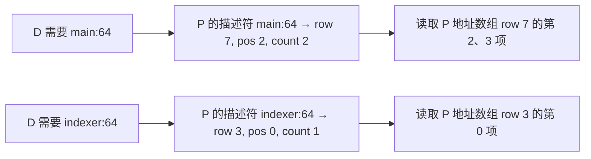
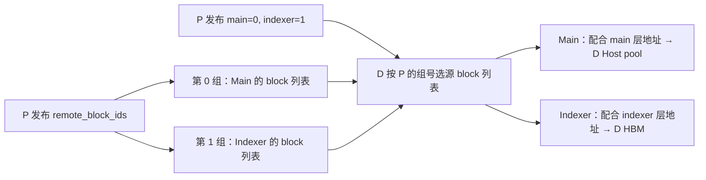
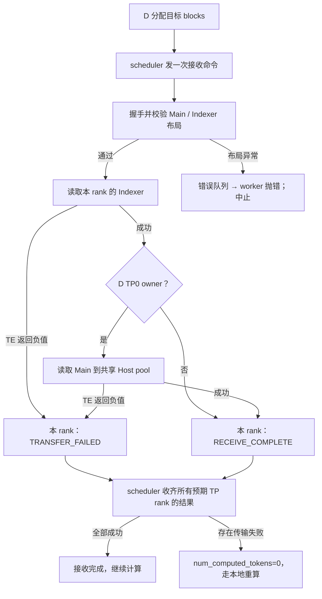
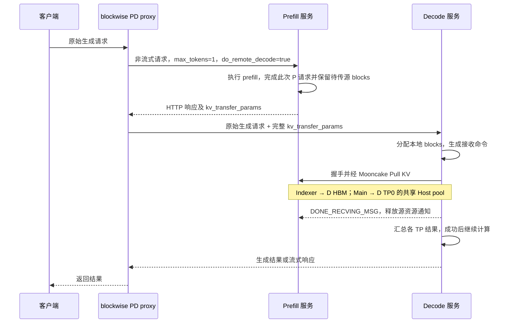

# 0.25rc1 blockwise MTP 迁移

> **2026-09-01 实验状态更新：当前目标配置无需本补丁即可跑通。**
> 原 `d1bf0bad2` 在没有合入 `ea5db1de7` 的情况下，已完成 GLM-5.2、
> P1/D3、DCP size=1、Decode target `FULL_DECODE_ONLY`、draft eager 的 32-token
> PD 冒烟。此前启动失败由错误停服留下孤儿进程导致。本文后续设计是针对潜在错层、
> 跨端 group 顺序和漏传的研究性增强，不是当前配置的必需修复。没有出现具体布局错误前，
> 保留原分支，不部署本补丁；先补 MTP 开启后的精度和 speculative 汇总统计。
> 证据复核见 [实验包复核](blockwise_mtp_025_experiment_review.md)。

## 与 layerwise 的关系

本分支直接基于 GitCode `mte_fuse_0723_mooncake_test_0827_add_block` 的
`d1bf0bad215f9fd552f7251cc952e12b9256af3a`。该提交在旧基线 `161698751` 上修复
Decode graph 的 external planner：使用紧凑的 CPU plan staging，分别处理 planner 与
operator membership 的偏移/stride，并校验 CPU、dtype、shape、连续性。
本补丁不修改该 manager 文件或其图模式测试，完整保留这次更新。

已用 `git merge-tree --write-tree` 检查最新基线与 `codex/layerwise-mtp-025`
的 `63218b48b`，没有 Git 文本冲突。但两种 PD 协议不能当作相同的运行路径：

| 项目 | layerwise | 本次 blockwise |
| --- | --- | --- |
| 传输 | P 按层 Push，最后一层发终态 | D 按请求 Pull，读完必要组件后报告接收完成 |
| MTP 完整性 | 层注册、逐层事件、末层 DONE | 缓存身份、源/目标地址、block 组号和覆盖范围 |
| Main Host pool | 绑定 runner 分配的池 | 同样绑定 runner 的池，由 D TP0 写 Main |

原 layerwise 分支不改、不合并。本分支没有 cherry-pick 其注册、AscendStore 或 DONE 修改。
源码可以共存；同一个 PD 请求不要同时挂两种 PD connector 去写同一个池。
这不禁止已有职责独立的 prefix-cache connector，但组合使用需另做生命周期验收。

## 本次修复

> 疑问：缺少文件 diff，起码说清楚文件、修改范围，影响。

答：下面是基线 `d1bf0bad2` → 代码补丁 `ea5db1de7` 的范围，
不是把上游整个分支都算成本次修改。
[完整代码 diff](https://github.com/lsjfy-open-com/vllm-ascend/commit/ea5db1de718aab49eb32dcc6935b53464d57b97c)
可以直接查看；本次批注答复仅修改本文档。

| 文件 | 修改范围 | 行数与影响 |
| --- | --- | --- |
| [mooncake_connector.py](../vllm_ascend/distributed/kv_transfer/kv_p2p/mooncake_connector.py) | `MooncakeAgentMetadata`、`register_kv_caches` / `_build_dsa_local_layouts`、scheduler 组号发布/读取、receiver `_get_remote_metadata` / `_execute_dsa_receive` / `_build_dsa_transfer_lists` | +81/-22；改变 DSA 握手描述与请求接收时的地址匹配、完整性校验；没有重新实现 MTP 推理 |
| [mooncake_dsa_layout.py](../vllm_ascend/distributed/kv_transfer/kv_p2p/mooncake_dsa_layout.py) | 新增 `dsa_cache_key`、`add_dsa_cache_descriptor`、`project_dsa_remote_arrays`、`infer_dsa_block_group_ids` / `select_dsa_block_groups` | +140；纯 CPU 元数据处理，分清缓存身份和 block 组号；不分配 KV 大池、不发起 TE 传输 |
| [test_mooncake_dsa_mtp_layout.py](../tests/ut/kv_offload/test_mooncake_dsa_mtp_layout.py) | 新增身份、分组、覆盖范围、失败终态及握手兼容回归 | +375；验证协议/映射逻辑，不代替实机生成测试 |
| [test_mooncake_dsa_shared_pool.py](../tests/ut/kv_offload/test_mooncake_dsa_shared_pool.py) | 补充现有夹具的层数和布局元数据 | +5；适配新字段，无生产行为变更 |
| 本文档 | 设计、限制、验收和批注答复 | 代码补丁时 +140；本次继续补充说明 |

非 DSA 路径保留原协议；新描述符是可选字段。主要风险集中在 P/D 注册布局是否匹配、
MTP 是否进入额外 manager group，以及真实异步执行时源数据是否已就绪。
不能因为改动集中在 connector，就宣称所有量化/拓扑/图模式都已经兼容。

### 1. 用缓存身份匹配 P / D

原 `kv_group2layeridx` 的内部序号会受 group 顺序、重复层号和带 `mtp` 的名字影响。
这些序号不一定是物理层号，也不保证 P / D 相同。因此不能移植 layerwise 的计数补丁，
然后继续用相同数组下标读写。

在 `MooncakeAgentMetadata` 增加可选 `dsa_cache_layout`：

```text
main:64    -> (实际 wire row, 起始 tensor position, 2)
indexer:64 -> (实际 wire row, 起始 tensor position, 1 或 2)
```

物理层号从 `model.layers.N`、`model.layers.N.mtp_block` 或短 `mtp.N` 名字解析。
短名字的 N 加 target 层数；`num_speculative_tokens=3` 不参与物理层编号。
支持 Main/Indexer 分开注册，也支持 P 将 Indexer 放在 Main tuple 的第 3/4 项。
描述符记录真实追加位置，不重排现有地址数组、不改变原 group 编号。

D 将 P 地址映射到本地需要的组件，再按原路径做 Indexer D2D 和 Main D2RH。
在开始读取之前检查所需 Main 和 MTP Indexer 是否存在、组件数是否一致、四组地址数组是否完整。
GLM 共享 target Indexer 的缺省行为保留，但必须存在对应 Main；MTP Indexer 不走这个豁免。

### 2. 明确 block 组号

> 疑问：补充，画图，形象一些。

答：需要分清两个维度：**缓存身份决定用哪层的地址；block 组号决定用哪组 block 列表。**
下面数字均为示意，不是实验数据；不表示 GLM-5.2 实际必有 64 个 target 层。



即使同一物理 MTP 层在 P 的 wire row 是 7，在 D 是 9，也按 `main:64` 匹配。
`row`、tensor position 都从 0 开始。它们不是 `remote_block_ids` 的组号。



D 的本地组顺序可以不同：本地目标 block 由 D 自己的实际分组确定，
不能把 P 的组号套到 D 本地。两个映射结合后，才知道“哪层的哪些源 blocks 放到哪里”。

原 D 默认第一组是 Indexer、最后一组是 Main；P 的组顺序不保证如此。
P 现在根据组件名确定实际组号，在请求 `kv_transfer_params` 中发送
`dsa_block_group_ids={main: ..., indexer: ...}`，不再依赖 DEBUG 开关。
D 按该映射选取原 `remote_block_ids` 中的列表。

P 原有按 prompt 长度裁掉额外 MTP 预留 blocks 的行为保留。传输的是 prompt KV，
不是把所有用于 speculative lookahead 的容量都复制过去。

### 3. 不允许漏传后报成功

> 疑问：这里是否有状态机？

答：有既有的请求生命周期控制，但**本次没有新增一个独立状态机类**。
状态分散在 scheduler 的 `command_emitted` / `results_by_rank`、worker 的活动命令和
`DsaLocalResultKind` 中。本次主要加严读取前检查，沿用原有结果汇总。
下图是这些代码的正常/失败路径抽象，不是源码中新加的枚举：



源码入口：receiver 的 `_execute_dsa_receive` / `_handle_dsa_request`，
scheduler 的 `build_connector_meta` / `update_connector_output`。
`finally` 中另行发送 `DONE_RECVING_MSG`，它请求 P 释放源资源，成功或失败均可能触发；
实际释放仍受 P 侧既有跟踪逻辑约束。**它不进入“接收成功”的判定。**
取消会清理并抑制正常结果上报；不应把取消当成成功。图未展开重试、超时和整个引擎调度。
此外，`finished_recving` 也可能表示失败后结束等待；判断成功必须结合各 rank 的结果类型，
不能只数 DONE 或 `finished_recving`。

- 缺少所需 MTP、缺少 Main、key/scale 组件数量不匹配：明确报错。
- Indexer 目标容量不能覆盖全部源 pages：报错，不再使用 `min(...)` 静默截断。
- 一个目标行只有部分有效 page 是允许的；拒绝的是实际源 pages 超过目标容量。
- `RECEIVE_COMPLETE` 仍在两条所需传输腿完成后产生；非 owner 只拉自己的 Indexer。
- `DONE_RECVING_MSG` 是释放 P 源 blocks 的通知，失败清理也会发送，不能当作成功证据。
  TE 返回负值仍走已有 `TRANSFER_FAILED` / 重算流程；布局校验异常走已有错误队列，明确中止，
  不伪装成接收成功。

## 兼容性与未覆盖范围

- 新字段是可选握手扩展，原地址数组保持不变。真实 msgspec 测试覆盖新读旧、旧读新编解码。
  无 MTP 旧对端保留原 positional 解析入口；这不等于所有跨版本拓扑已经实测。
- **MTP 请 P、D 同时升级到本分支。** 旧 P 没有描述符时，新 D 的 MTP 接收会明确拒绝。
  P 未启用/未注册 MTP 而 D 要求 MTP，也会报缺少缓存。proxy 必须原样转发新增请求字段。
- 本轮仍是一组 Main、一组 Indexer，或二者同属一个 manager group。
  如果 MTP 因不同 KV 规格被放进额外 manager group，当前每请求两套 block-ID 列表不足以描述它。
  现在明确拒绝这种配置；下一阶段需要扩展命令为逐层/逐组 block-ID 路由，不能只取消校验。
- GLM-5.2 的实际 MTP 层数、Indexer dtype/scale、KV 分组必须从目标环境核对。
  W8A8 是权重量化信息，不能据此断定 KV 或 Indexer 是否 C8。
- 本轮不扩展 DCP。上游 blockwise D 侧仍要求 `DCP * PCP == 1`、Decode PP=1。
  首轮 P / D 都使用 PP=1，DCP / PCP 的关闭值为 size=1。
- MTP 真正多物理层、更多分组、不同 P/D 模型缓存规格不在本轮支持声明内。
- P 源缓存发布与 drafting 完成的先后、AsyncScheduler、拒绝回退、prefix-cache 命中、
  graph replay 的 planner 数据更新，都需要实际 NPU 验证。没有用新增全局同步掩盖这些风险。

## 修改范围与运行路径选择

> 疑问：用 blockwise 时，怎么确保没走 layerwise，是 vLLM 启动脚本里设置的还是由 proxy 脚本完成的？

答：**connector 由 P、D 的 vLLM 启动配置选择；proxy 负责与它配套的请求协议。**
单独换 proxy 不会把已启动服务内的 layerwise connector 变成 blockwise。

| 检查位置 | 本分支 blockwise DSA 应是什么 | 作用 |
| --- | --- | --- |
| P 的 `--kv-transfer-config` | `kv_connector="MooncakeConnectorV1"`、`kv_role="kv_producer"` | P 发布源缓存及请求元数据 |
| D 的同一配置 | `kv_connector="MooncakeConnectorV1"`、`kv_role="kv_consumer"` | D 发起 blockwise Pull |
| P、D 的 `kv_connector_extra_config` | `"dsa_pd_offload": true`，JSON 布尔值 | 在该 connector 内启用 Indexer D2D + Main D2RH 的 DSA 路径 |
| proxy | 下文的 blockwise PD proxy，原样转发 `kv_transfer_params` | 将 P 的源描述交给 D，不传实际 KV 数据 |

上表是应核对的字段，不是完整启动配置：保留已有 backend、Host pool、TP、MC2 等配置。
注册入口在 [kv_transfer/**init**.py](../vllm_ascend/distributed/kv_transfer/__init__.py)：
`MooncakeConnectorV1` 对应 `kv_p2p.mooncake_connector.MooncakeConnector`；
`MooncakeLayerwiseConnector`、`MooncakeLayerwiseToDramConnector` 和
`MooncakeLayerwiseD2RHConnector` 是另外的注册项。
若用了 `MultiConnector`，也要检查其内部配置，不能同时装上两条写同一池的 PD 路径。

在实验机机内核对**实际启动参数和最终解析配置**，而非只看某份未被执行的脚本；
再确认实际类/模块，并用 receiver 的 `INDEXER_D2D` / `MAIN_D2RH` 阶段作为请求执行证据。
这些阶段的原始诊断可能包含地址和 IDs，只能提取阶段计数、组件数量、owner 标记等白名单信息。
只看 proxy 文件名、服务启动成功或某条日志缺失，都不能证明走对了路径。

本次生产代码范围仍是：

- `vllm_ascend/distributed/kv_transfer/kv_p2p/mooncake_connector.py`：握手扩展、
  显式组号、接收前映射与完整性检查。
- `vllm_ascend/distributed/kv_transfer/kv_p2p/mooncake_dsa_layout.py`：独立的缓存身份与映射逻辑。
- `tests/ut/kv_offload/test_mooncake_dsa_mtp_layout.py`：新增回归；
  `test_mooncake_dsa_shared_pool.py`：补齐现有测试夹具的新元数据。

没有修改 layerwise、AscendStore、ModelRunner、Host pool 分配、MTP 权重加载、量化算子或环境变量。
映射发生在每次 PD 接收的 CPU 控制路径，不在每个 Decode token 的设备计算路径中。

## Main / Indexer 与 proxy 时序

> 疑问：这个路径是 PD 传输 Indexer 和 Main 分开对吧，所以这俩都开了？

答：对，是**同一个 blockwise DSA connector 内的两条传输腿**，不是两个 connector，
也不是 `MooncakeConnectorV1` 和 `dsa_pd_offload` 各自控制一条腿。
前者选择实现，后者启用该实现的 DSA offload 协议。
实际需要的 Indexer 从 P HBM 拉到 D 各 rank 的 HBM，Main 从 P 拉到 D 的共享 Host pool。
当前 Main 仍由 D TP0 写入；本补丁没有迁移为多 TP 并行写 Main。
同一 rank 上先 Indexer、再 Main，非 owner 跳过 Main；不同 rank 可分别工作。
共享 Indexer 的合法空项可以跳过，并非每一层都必有独立 Indexer 传输。

> 疑问：为什么要用普通 proxy，不应该是专用于 PD 分离的 proxy？不太懂脚本及机制、时序。

答：原文“普通”用词不准确，已改称 **blockwise PD proxy**。
[load_balance_proxy_server_example.py](../examples/disaggregated_prefill_v1/load_balance_proxy_server_example.py)
本来就是 PD 分离代理，不是普通的单服务转发代理。该脚本当前逻辑为：



`build_prefill_request` 把 P 请求限制成 1 个输出 token；`assign_instances` 等待 P 的 HTTP
响应，再把响应中的整个 `kv_transfer_params` 对象赋给 D 请求。它没有把 P 的那个输出 token
拼到 D 的 prompt；D 接收的是原始生成请求及缓存信息，由 vLLM 自己处理可复用前缀与剩余计算。
P 返回 HTTP 并不自动证明异步 MTP 的所有设备写入都已完成，这仍需实机验证源发布时序。

实际 KV 字节在 P/D 的 Mooncake TE 之间传输，不经过 proxy。若实验机采用自定义代理，
无需只为文件名切换，但必须具有上述 P 先完成、完整转交元数据的协议。
不能用字段白名单漏掉 `dsa_block_group_ids` 等扩展。

[layerwise proxy](../examples/disaggregated_prefill_v1/load_balance_proxy_layerwise_server_example.py)
则先给 D 发 `do_remote_prefill=true` 和 `metaserver`，D 经 metaserver 回传目标信息后，
proxy 的 `dispatch_prefill_batch` 再派发 P。这配合 P 按层 Push，时序不同，不能直接混用。

## 图模式、MTP 开关与上游修复

> 疑问：无 MTP eager，此开跟开图不相关对吧？全局的开图模式影响 MTP 中的图不开吗？

答：**启用 MTP**和**是否用图执行**是不同维度，但图开关有上下级约束，不能完全独立理解。
MTP 开启后，draft 提出候选，target 验证候选；`num_speculative_tokens` 是候选步数，
不是物理 MTP 层数，也不是 graph 数量。eager 只是执行方式，不代表 MTP 关闭。

当前分支的 [NPUModelRunner._use_aclgraph](../vllm_ascend/worker/model_runner_v1.py)
要求三项同时满足：`cudagraph_mode != NONE`、`mode == VLLM_COMPILE`、
主模型 `enforce_eager=false`。因此仅删除 `--enforce-eager` 还不能证明实际启用图。
[llm_base_proposer.py](../vllm_ascend/spec_decode/llm_base_proposer.py) 先计算：

```python
self.use_cuda_graph = self.runner._use_aclgraph() and not self.speculative_config.enforce_eager
```

**随后该文件还有 GLM 特例：只要 `hf_text_config.model_type` 包含 `glm`，
便强制 `self.use_cuda_graph = False`，保留 target 的图设置。**
这一逻辑已在本次基线中，不是本 connector 补丁新增。
实际 GLM-5.2 配置必须确认命中该判断；不能只凭对外模型名称推断。

| 条件（已启用 MTP） | target | draft |
| --- | --- | --- |
| 全局 `--enforce-eager` | eager | eager；全局关图也约束 draft |
| target 满足开图条件，speculative 的 `enforce_eager=true` | 可按调度使用图 | eager |
| target 满足开图条件，speculative 的 `enforce_eager=false`，且命中本分支 GLM 判断 | 可按调度使用图 | **仍强制 eager** |
| target 满足开图条件，speculative 的 `enforce_eager=false`，非 GLM | 可按调度使用图 | 具备开图资格，仍受后端和 capture/dispatch 条件限制 |

所以当前 GLM 的“graph + MTP”验收，准确含义是 **target graph + draft eager**。
不得把它写成“GLM MTP draft graph 已验证”。本轮不删除 GLM 保护逻辑；若要让 draft 真正跑图，
那是涉及 proposer 输入、attention metadata 和 capture/replay 的另一项能力迁移。
P、D 是两个独立服务，各自的这些参数都要记录；D 开图不会替 P 开图。

图机制可以这样理解：eager 每轮由主机逐个提交设备操作；图模式先为支持的 batch/shape
捕获一组设备操作及依赖，再把每轮的新输入填进稳定缓冲区并 replay，以降低重复提交开销。
图复用的是执行结构，不是上一轮答案。不同 batch/shape 可能走不同图档位、padding 或 eager；
FULL 与 PIECEWISE 的捕获范围也不同，需记录实际 mode。MTP 改变 target 验证的 token 数和
attention metadata，即使 draft eager，也会影响 target 图的输入形状与调度，所以仍要验证组合。

本路径还有 CPU planner，不能简单理解成“所有工作都在 NPU 图里”：


源码在 [kv_offload_decode_manager.py](../vllm_ascend/distributed/kv_transfer/kv_offload_decode/kv_offload_decode_manager.py)
的 `publish_plan`、`run_planner` 和 `if capturing` 分支；
[kv_offload_decode.cpp](../vllm_ascend/distributed/kv_transfer/kv_offload_decode/kv_offload_decode.cpp)
的 `enqueue_lru_resident_compact_with_plan_stable_rows` 通过 `aclrtLaunchHostFunc` 入队 CPU 回调，
并针对图生命周期保留 payload。这些 stream/callback 依赖是设计上让 replay 使用本轮数据的手段，
实际 CANN/torch-npu 环境下是否正确重放，仍须实测，不能仅凭 Python 代码证明。

上游 `d1bf0bad2` 修复的是 CPU planner 和设备 operator 两种布局的混用：
CPU plan 使用紧凑连续的 `topk + control` 行宽、从第 0 列起写；设备 membership 的 plan
仍在原偏移。分别使用正确的偏移/stride，并经 NPU staging 发布到设备 plan 区。
这既不改变 blockwise/layerwise 选择，也不解除 GLM draft 的 eager 限制。
捕获成功只证明 capture 没立即报错；验收必须执行多轮 replay 并改变请求长度/批次，
避免只用一个输入反复跑而漏掉 stale plan、shape 或跨流顺序问题。

## 实验机验证顺序：必要项与故障定位项分开

> 疑问：讲清楚实验分别证明什么及必要性；这么多实验成本太高，图模式也需仔细解释。

答：原来的顺序把功能验收、定位矩阵、发布回归混在一起，成本确实不必要。
图机制见上一节；下面替换原矩阵，**不再要求每种步数组合都跑一遍完整回归**。

### 0. 一次性检查，不重复拉服务

固定 **0.25rc1、ARM、Python 3.12、NPU、GLM-5.2 W8A8**；不按 Dockerfile 默认的
`v0.25.1` 混换版本。机内核对 vLLM/Ascend/Mooncake/torch-npu/CANN 的实际版本、提交与导入来源。
P/D 都使用本补丁，并核对上文 connector/proxy 选择。

提取 target/MTP 物理层数、Main/Indexer 的 manager group 数、组件 dtype/shape/tuple 长度。
发现同一组件分属多个 manager group，先停止：这是当前显式不支持的边界，多开实验不能解决。
保留既有 Mooncake backend、runner Host pool、TP、MC2，
`multistream_overlap_shared_expert=false`，其他 overlap 按现有关闭基线；
首轮 P/D 都 PP=1，DCP/PCP size=1。本轮不同时扩 DCP。
注意这里不是关闭所有名字含 overlap 的选项：DSA D 侧仍强制要求
`kv_offload_decode_config.enabled=true`、`use_fused_overlap=true`，
P 侧要求 decode offload 的 `enabled=false`。这个 offload 的 fused overlap 与
`multistream_overlap_shared_expert` 是不同配置，不能一起关掉。

具备依赖的环境执行一次下列 UT，不用随每种启动配置重复：

```bash
pytest -q \
  tests/ut/kv_offload/test_mooncake_dsa_mtp_layout.py \
  tests/ut/kv_offload/test_mooncake_dsa_shared_pool.py \
  tests/ut/kv_offload/test_mooncake_dsa_metadata.py \
  tests/ut/kv_offload/test_mooncake_connector.py \
  tests/ut/kv_offload/test_kv_offload_decode_external_plan.py
```

它们检查布局、缺失组件、容量边界、结果流转和 planner 参数，不证明 NPU 上准确性或传输时序。

### 1. 最少三组配置，不做步数笛卡尔积

| 组别 | 配置与工作量 | 要证明什么；失败时怎么办 |
| --- | --- | --- |
| A：无 MTP 小回归 | 当前补丁，无 MTP，复用你已验证的 target graph 模式，只跑下面的固定小请求集 | 新映射没有破坏普通 blockwise，并保留上游图修复；失败先查基础路径，不叠 MTP |
| B：隔离 MTP | P/D 都启用拟使用的 MTP 步数，例如都为 3；两侧全局 eager | 不依赖图，验证 MTP 缓存匹配与实际生成；失败查分组、完整性、发布时序，不查图 |
| C：交付配置 | MTP 步数同 B，恢复计划使用的 target graph 模式；GLM draft 仍 eager | 验证 MTP 与 target 图、external planner 多轮 replay 的组合；B 过 C 不过才重点查图与 plan 更新 |

A 可以复用**同一补丁、同一环境和相同配置**已完成的证据；旧上游提交的冒烟结果可作参考，
不能替代本补丁的无 MTP 回归。无需为 A 重做完整基准。
B/C 首轮保持 P/D 步数一致；如果交付需求就是 P=1/D=3，则将 B/C 都设成那个实际组合，
而不是再加全套 1/3 组合。P/D 两侧都必须实际注册 D 所需的 MTP 缓存。

每组先用相同的机内固定小请求集，建议覆盖四种场景：短单请求、跨 block 边界、
两个不同长度请求并发、一个足够经历多轮 speculative 验证/graph replay 的生成。
固定输入与采样参数，用 greedy 做首轮比对；模型输出、逐 token 比较均留在机内。
A/C 在相同 target 图配置下比 MTP 开关，B/C 在相同 MTP 配置下比图开关。
A/B 同时改变了两个因素，不用它单独归因。若产生分歧，记录首次分歧位置和计数，
再在机内判断数值误差、非确定性或逻辑错误，不能简单把差异全部归为 connector。

同时确认有真实 PD 命中和必要 MTP 组件的传输计数，而非一直本地重算；
确认 speculative 统计中确实生成了候选，不能只凭开关存在认为 MTP 执行了。
有接受/拒绝统计时记录汇总；小样本没有发生拒绝，就标记“未覆盖拒绝路径”，不能写成通过。
这组检查是功能门槛，不声称覆盖所有负载或性能稳定性。

### 2. 只有定位需要才加实验

B 失败时，可以降到 P/D 都 1 步，区分初次 draft 与多步迭代；
需要定位异步或 P/D 步数差异时，再改变一个因素。C 失败时，才拆 P 图/D eager、
P eager/D 图，或固定更小 batch。不得一次切 MC2、量化、overlap 和 MTP 步数。

缺失描述符、组件数错误、覆盖不足、TE 返回负值先用上述 UT 注入，
不要求每组 NPU 服务重复故障注入。真实链路中断/取消的资源回收仍是后续集成验收项，UT 不能替代。

### 3. 发布前只补一轮实际使用场景

B/C 通过后，针对计划上线的 prefix cache、chunked prefill、长生成、拒绝回退与取消，
在最终 C 配置补一轮；不用将这些场景和每一种步数/图开关做全排列。
需要性能结论时再跑固定负载基准，汇总延迟、吞吐和峰值内存；不能用几条冒烟请求宣称性能提升。
未跑场景明确标注“未验证”，不能把三组小验收扩写成完整生产保证。

日志仅在机内处理。允许外传版本/提交、开关、层数、组数、dtype/shape、测试计数及脱敏分析。
不外传完整日志、prompt、输出文本、token/block IDs、地址、IP、路径、请求标识或凭据。
不能把原始日志交给外部 agent 后再让其过滤。

## 本机验证记录

- 33 项隔离源码回归通过：使用真实映射模块、提取的实际 scheduler / receiver 方法和真实 msgspec。
- 四个 Python 文件的 Python 3.12 语法检查、修改的 connector 与新增文件 Ruff 检查通过。
- 全仓 `bash format.sh ci` 已执行但未通过；在未修改的 `d1bf0bad2` 上重跑，
  复现相同类别的 Ruff、拼写、clang-format、package init、禁用 import 和 symbolic shape 问题。
  没有带入自动格式化产生的存量改动；新增映射模块、测试和本文档未被检查器修改。
- 这不是完整 vLLM 模块导入测试，也不是 NPU、RDMA、graph 或真实权重测试。
- 完整 UT、MTP 生成准确性、图模式、性能测试待实验机执行；不声明 MTP 已实机验证通过。
