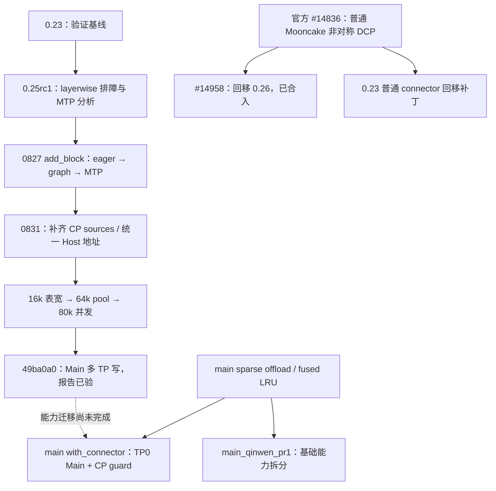

# DSA 适配、实验与设计工作汇总（2026-09-07）

本次核对了本地研究分支、GitCode 0827/0831 分支、Shichang-Zhang GitHub 仓库的全部五个分支，以及
官方 PR #14836/#14958 的状态。实验结论来自已上传的报告；本次没有登录实验 NPU 服务器重跑。
下文的“已实现”“报告通过”“待验证”分别表示代码证据、实验方记录和仍缺少的验收证据。

## 1. 当前总判断

- **0.23**：保留已由用户确认验证的 D2RH PD 基线；另有普通 Mooncake SFA 非对称 DCP 回移补丁。
- **0.25rc1**：blockwise DSA Host offload 的实机证据最完整。0827 代码已到 Main 多 TP 写，0831 报告
  覆盖 P8/D8、P8/D1、MTP+target 图、16k–80k C8。仍不能外推为 1M、所有 PCP/DCP 或生产长稳通过。
- **0.26**：完成普通 MooncakeConnector 的非对称 SFA-DCP 回移分析和版本接口收敛；官方 #14958 已合入
  `releases/v0.26.0rc`。这条线不等于完整的 DSA Host offload 迁移。
- **main**：现在有基础 offload/社区 PR1 和 blockwise connector 两条适配线。新 connector 当前仍是
  TP0 Main owner，sparse offload 配置仍拒绝 CP>1；旧 0.25 的 DCP、多 TP 写能力尚未完整迁入。



这里的 P8/D1、P8/D8 表示两侧 **DCP size**，不表示 P/D 的 TP 数量。实验中 DCP=1 的 Decode
仍可有 TP8；因此 P8/D1 的 Phase C 也可以由八个 Decode TP 分担源 CP shard 的传输。

## 2. 本次核实的分支快照

| 仓库 / 分支 | SHA | 定位 |
| --- | --- | --- |
| GitCode `feat/dsa-d2rh-pd-validated-base-20260826` | `b9bac806d` | 用户确认的 0.23 D2RH 验证基线 |
| GitCode `mte_fuse_0723_mooncake_test_0827_add_block` | `49ba0a0c3` | 0.25rc1 运行代码；Main 多 TP 写 |
| GitCode `exp/rebase25-add-block-20260831` | `25ef784f3` | 实验报告到 Phase C P8/D1；其代码树不等同于报告所运行的 0827 SHA |
| Shichang GitHub `main` | `35e7c6d8b` | 该 fork 的 main 快照，提交日期 9 月 2 日 |
| `dsa_offload_rebase_main_0912` | `3d5013ee2` | 基于上述 main 的 fused offload / Mooncake backend 基础 |
| `dsa_offload_rebase_main_0912_test` | `3df84628c` | 基础线加 device API 修复和 colocate staging 调试支持 |
| `dsa_offload_rebase_main_0912_with_connector` | `3bfe68748` | 基础线加 blockwise DSA connector、本地 Host view 修复 |
| `main_qinwen_pr1` | `933e8dcc2` | 基于较新的上游 `219a7e7ef`；社区 PR1 范围的六个提交 |

`0912` 是分支名，不能据此认定代码日期是 9 月 12 日。上述新分支最新提交实际发生于 9 月 3–6 日。
同样，Shichang fork 的 `main` 不等于查询时官方 main 的最新 HEAD。

## 3. 0.23：验证基线与普通 connector 回移

我们以用户已验证的 `b9bac806d` 为迁移参照，追踪 layerwise、D2RH、shared segment、Main/Indexer
布局、MTP layer 数与 ModelRunner/connector 的内存责任边界。重点建立了以下认识：

- runner/manager 负责按 KV spec 规划和绑定 Host/NPU cache，connector 消费地址和布局执行传输；
- 同一个 TP 域中的共享 Host pool，与每个进程自己的虚拟地址、TransferEngine 注册范围，是不同对象；
- target layers、MTP cache layers、共享 Indexer 不应简单按列表下标或相同层数推断；
- 0.23 已验证配方不能直接证明 0.25 上同名接口、图模式和 DCP metadata 相同。

另外，本地 `fix/sfa-dcp-asymmetric-v0.23@35be6f7ba` 是普通 Mooncake SFA 非对称 DCP 的独立回移。
它与用户的 D2RH 验证基线是两份不同代码；不能合并描述为“0.23 所有 DCP/offload 组合都通过”。
该补丁针对0.23没有独立Indexer spec的差异适配类型/scale判断，并防止非指定endpoint将缺失的
replicated Indexer IDs回退为regular IDs。本地Ruff、语法和diff检查通过，定向pytest及NPU未执行。
原设计入口与职责说明已保存在验证基线的`docs/dsa_main_d2rh_0817_implementation_progress.md`。

## 4. 0.25rc1：从起服排障到 blockwise 长上下文

### 4.1 环境与诊断工具

测试基线始终按用户确认记录为：NPU、ARM、Python 3.12、0.25rc1、GLM-5.2 W8A8、Mooncake 0.3.13，
用户已在容器内切换源码并重编算子和 Mooncake。早期采集器读到的包元数据不能推翻运行源码确认。

我们建立并推送了 `codex/mooncake-diagnostics-skill`：采集器、白名单字段、分析模板和可直接交给
实验 Cursor 的任务书。原始日志、prompt、输出和机器信息留在实验环境，只回传
`facts.json`、`evidence.txt`、`analysis.md`。离线采集本身不需要下载模型或联网依赖。

排障中区分了：P 初始化 IndexError、错误使用普通 proxy 的 layerwise 首请求问题、图模式 external
planner 布局问题，以及 ZMQ 握手端口冲突。后者有实验重试支持：错误停服留下孤儿 worker，正确停服
后原配置可启动；不能归因成 MTP 每步创建新端口或 Mooncake 版本必然不兼容。

### 4.2 layerwise → blockwise 与 MTP

最初基于 0.23 检查 layerwise 的 MTP 缓存层和共享组件映射，形成 `codex/layerwise-mtp-025`。
随后根据用户方向转到更新了 eager/图修复的 add_block，形成 `codex/blockwise-mtp-025` 的代码研究和文档。
layerwise候选包含物理层去重、Main/Indexer聚合、事件收尾和异常slot释放，记录19项隔离源码回归通过；
未据此宣称完整模块、NPU或graph验收通过。

研究补丁增加过 cache 物理身份描述、Main/Indexer 组映射及覆盖检查；但实验侧在未合入这些补丁的
`d1bf0bad2` 上，已经跑通 P-MTP1 / D-MTP3、draft eager、Decode target `FULL_DECODE_ONLY`。
因此我们撤回了“必须先迁这份 MTP 补丁才可运行”的判断，把它保留为研究候选。

本地该研究补丁记录了 33 项隔离源码回归通过；这不是完整 NPU、RDMA 或模型生成验收。
原分支天然跑通的结论也只覆盖当时 DCP=1 的具体配方，不能外推到后来的 DCP>1。

### 4.3 DCP 数据正确性：确认短 prompt 假阴，补全 source 覆盖

实验进一步确认，早期 P8/D1 的短请求“成功”没有证明完整 Main KV 已转移：只有一个 Prefill shard
的数据被搬到 Host，短输入可能没有触达缺失区域。根因不能只看入口 guard。

我们与实验侧共同收敛为现有接口上的地址修复：

```text
Prefill CP endpoint + CP-local page
    → 全局 token 位置
    → 已分配的 Host block ID + block 内 offset
    → MAIN_D2RH
```

Main 写 Host，Indexer 保持 NPU→NPU 的 `INDEXER_D2D`。不通过 `min(src,dst)` 截断掩盖形状差异。
先由 TP0 拉齐全部必要 CP sources；正确性闭环后再做多 TP 并行。

针对用户担心社区合入范围过大，我们收回了“重写 v2 Host pool”的表述，保留共享 pool 和既有 reader，
将第一阶段范围压到 source 选择、传输地址、block namespace 与必要的调度一致性。

### 4.4 对称 DCP 的两次关键修复

| 症状 | 根因与处理 | 实验记录 |
| --- | --- | --- |
| DCP8 下约 16k 越界，129 IDs 放不进 128 列 | scheduler 已发 global Host pages，InputBatch 仍按 CP-local 表宽；统一 storage view，并确保真正 reinit InputBatch | 16k/32k C1 通过 |
| 64k 长期 WAITING、没有触发 Main pull | replicated Indexer 把 NPU page 开销放大，pool 约 426，小于该请求实际 513 页需求；修正 Host max-memory 与 offload Indexer replication | pool 到 1432，64k C1 通过 |
| 容量不够时仅打印错误、继续等 | 加入初始化 fail-fast，要求至少覆盖一个配置允许的最大请求 | `0418073ad` |
| runtime DCP 与存储地址含义反复混淆 | 显式命名 `DEVICE_LOCAL_CP` / `UNIFIED_HOST_MAIN` / `GLOBAL_LOGICAL_INDEXER` | `0d171adb8` |

513 页对应报告中的实际输入 65548 tokens（包含包装 token）；精确 65536 / 128 是 512，不能把
513 写成所有“64k”输入的固定值。128、1024、DCP8、pool1432 也都应由配置和运行时布局推导。

### 4.5 Main 多 TP 写已在旧实验线落地

`49ba0a0c3` 让同一 DP/TP 域内各 Decode TP 负责自己的 Prefill CP shards，写共享 Host pool 的
不重叠字节范围；TP0 仍是共享段 owner。此处是 PD 导入的并行写，不能与 Decode 每步新增 token 的
写回混为一谈。后者仍需根据 KV 是否复制、当前写回路径决定唯一 writer。

“每 TP 有明确写范围”不意味着各 TP 持有连续、独立、2 MiB 对齐的私有 cache。当前 2 MiB 对齐主要
作用于分配和层内 K/V plane 起点；shard 的 block 可以交错。共享物理页、注册权限与实际写范围要分开。

以下均为 0831 最新报告对 `49ba0a0c3` 的记录，本次未复跑：

| 配方 | C1 | C8，N=32，out=256 | 辅助验证 |
| --- | --- | --- | --- |
| P-DCP8 / D-DCP8，MTP+target 图 | 16k TTFT 8.17s；64k 36.60s | 16/32/64/80k 各 32/32 成功 | 精度小集5/5；报告UT28 passed；各TP owned_cp 与零transfer_failed记录 |
| P-DCP8 / D-DCP1，其余同 Phase C | 16k TTFT 8.24s；64k 36.62s | 16/32/64/80k 各 32/32 成功 | 冒烟及精度小集5/5 |

C1 16k 的 TTFT 相比 Phase B 的 10.22s 降至 8.17s，约20%；64k 从38.82s降至36.60s，约6%。
80k C8 的可直接对照档从85.18s降至84.36s，约1%。这是有限样本的整体配方结果，不能当作独立
网络带宽测量或统计显著性结论。报告将 C8 主要限制归于 Prefill 排队和算力，仍需分段 profiling 验证。

同一 Phase C 的64k C8，8/8 TPOT为44.8ms，P8/D1为38.5ms。可见 Decode DCP 开大并不必然改善
每token延迟；通信、metadata、onload和MTP接受率均要测量。32/32代表请求成功数，并非长上下文
逐token等价性或完整模型精度分数。早期MTP接受率30–40%的反馈尚无最新受控对照证明已解决。

## 5. 0.26 与官方 main 的非对称 DCP

官方普通 MooncakeConnector 的 #14836 处理 SFA P 开 DCP、D 关 DCP时的 Main/replicated Indexer
传输语义；#14958 将这一能力回移到 `releases/v0.26.0rc`。

本次API确认：

- #14836：已合入 main，2026-08-31，merge `1cfec6e411`；
- #14958：已合入 `releases/v0.26.0rc`，2026-08-28，merge `3827486f1`，PR head `1009938d4`。

我们分析过远端DCP决定 replicated Indexer 处理、remote/local CP整除条件、CP-local block拆分和
多endpoint gather。回移过程中还追踪了main的 `num_physical_draft_tokens` 与0.26的
`num_draft_tokens` 接口差异，避免为兼容误加运行时inspect分支。

这些工作证明普通connector的版本接口和非对称传输适配已收敛，不能替代 Main→Host、fused reader、
MTP图回放、Host pool生命周期的独立验收。PCP也必须逐路径判断：普通connector能处理相关metadata，
不代表legacy runner、layerwise、sparse offload或PCP+DCP组合全部支持。

## 6. 新 main 仓库：已做的迁移与尚未带过来的能力

### 6.1 基础线与 test 线

`dsa_offload_rebase_main_0912` 在 main 的原生 `sparse_kv_offload` 框架上适配：

- fused sparse attention overlap、LRU resident cache 与external planner；
- CPU helper 合入 `_C_ascend` 的构建/绑定，替代旧的独立扩展组织；
- `MooncakeHostKVPool` 与共享段的分配、局部tensor切片及释放；
- Mooncake membership staging 与固定长度 `index_copy` 图模式写回；
- `host_backend` 选择与对应配置校验。

配置入口已经从旧 `kv_offload_decode_config` 转为 `sparse_kv_offload_config`，不能原样复制0.25启动
参数。原生main组织方式也从 `kv_offload_decode` 转为 `sparse_kv_offload`。

`_test` 分支另加device API修复，以及放开Mooncake colocate调试所需的
`keep_device_kv_cache=true`。这个放宽没有自动进入同名 `_with_connector` 分支；三者是分叉，不是一条
线性版本链。分支名带test也不构成测试通过证据。

### 6.2 with_connector 最新分支

`_with_connector` 相比共同基础 `3d5013ee2` 是3个提交、7个文件、约+1698/-52：

| 提交 | 内容 |
| --- | --- |
| `026611dbb` | blockwise DSA metadata、scheduler/worker结果汇总、Main D2RH与Indexer D2D |
| `be3f0cdb6` | model runner使用torch_npu device API |
| `3bfe68748` | 各TP使用本进程有效的Mooncake Host views |

最新修复的实质是进程地址正确性：不能把TP0虚拟地址的整数值广播后当作TP1的有效映射。各TP应基于
自己映射的同一共享段构造本地tensor views；这不是给每个TP申请独立物理pool，也不是多TP Main写。

当前边界由代码明确给出：

- sparse offload仍拒绝 `PCP×DCP>1`、PP>1以及model_runner_v2；
- 只有pool owner建立Main layout并调用pool.register；其他TP没有Main写任务；
- DSA调度按每个DTP选择一个Prefill leader endpoint，没有旧0827的完整CP-source遍历与统一view重组；
- `RemoteSource`未携带旧版完整的remote CP参数，不能靠删除配置guard获得正确DCP传输；
- 有全TP结果汇总与失败终态，但“各rank已提交的任务完成”仍不等于“该请求所有必需KV均已覆盖”。

所以新main当前应定位为 **CP=1下的blockwise offload接入与地址/图适配阶段**，而不是0.25全部能力
已平移完成。不能把0831的P8/D8、80k实验结果记到新main分支名下。

### 6.3 main_qinwen_pr1

该分支基于较新的上游 `219a7e7ef`，自己的补丁为6个提交、19文件、约+3688/-410。
如果直接与fork的旧main `35e7c6d8b`比较，会看到442文件变化，其中大量是上游更新，不是我们的改动。

提交正文明确按PR1范围收敛：fused/LRU、CPU helper、通用 `HostKVAllocator`、本地Host views与相关UT。
最新`933e8dcc2`让Host pool单测不依赖真实Mooncake shared_segment安装。

Mooncake pool类虽然存在，运行时Mooncake backend选择、专用accessor、membership/index_copy接线和
blockwise DSA connector仍留在后续范围。它可作为社区基础PR的候选，不可当作完整Mooncake PD运行分支。
本次在该fork查询到PR列表为空，未据分支名推断已经正式开出或合入社区PR。

### 6.4 实验侧在新main明确记录的三个性能问题

`unsolved_problems.md`给出了新的关注点：

1. **membership发布**：CPU pinned plan → 普通NPU staging → Mooncake membership，两段串行小拷贝，
   多个owner layer重复，约4KiB/token；需要测提交、copy与stream wait，而非只算字节数。
2. **transfer entries尚未合并**：报告记录22 blocks产生每TP 924个Indexer entries；可复用普通
   connector连续区间合并，但必须同时满足源/目的字节连续，并正确处理stride与token scale。
3. **graph descriptor callback**：slot_mapping D2H、CPU更新index descriptor、再H2D仍有串行开销。
   已把descriptor生成从每层一次降至每decode step一次；直接把callback搬到side stream的尝试
   没有在replay正确刷新，不能据此宣称异步化完成。

新仓尚未看到与0831同等口径的端到端正确性/接受率/长上下文矩阵。9月7日本次查询时，最新
with_connector SHA与PR1 SHA对应的Actions运行均为queued；没有可据此宣称的最新绿色CI。
PR1树内已有0.26rc1 release notes和Ascend 0.26rc1↔vLLM 0.26.0的版本映射，但它是main源码树；
这些文档不证明实验容器实际使用该release组合，更不能据此把main实验记到0.26验收栏。

## 7. 最近的Host pool、1M与网络设计讨论

我们澄清了四件独立事项：

- DCP决定计算侧KV序列分片；DP是请求调度和容量域，增加DP不会自动拼接单请求容量；
- TP0创建共享pool与TP0–7并行写可以同时成立；写范围互斥不要求每个TP拥有独立pool；
- 2MiB对齐、block table容量与RDMA注册限制不同，1M/128对应8000个int32 IDs，约31.25KiB；
- 按旧GLM布局K512+V64、BF16、78/79层估算，1,024,000 tokens的Main payload约85.8/86.9GiB。
  新main或其他模型必须重新读取运行时shape/spec/dtype，W8A8不能替代KV dtype。

动态多注册区间、TP/NIC/NUMA亲和、按tokens/blocks做DP admission、长短请求分池，仍属设计建议。
本次没有发现多MR或1M实机验证已在上述新分支落地。rank-local物理pool属于可选的更大改造，不能
当作当前多writer的必要前提；也没有无条件“理论最优”的SLO结论。

关于64GiB，需把之前的确定性说法收紧：应用代码目前能证明一次提交完整pool给
`register_memory(base,nbytes)`，不能单凭这行或`shared_host_regions=158`日志推断底层实际硬件MR数量。
所查旧分支的TransferEngine以`ascend` transport初始化；具体是否受RoCE max_mr_size、Ascend transport、
shared_segment或其他注册资源限制，应以实验机实际Mooncake构建、transport和错误栈确认。
如果确为单MR限制，多区间注册是候选解法；不是保证“任意TP分配87GiB都能直接成功”。

## 8. 已交付、候选实现与下一轮建议

已交付的协作资产包括诊断skill、layerwise/blockwise MTP迁移文档、实验复核、MLA/DSA/SFA说明、
DCP控制面/数据面/时序/物理视图HTML、Host地址映射与64k收敛方案，以及本次版本总账。
我们的源码分析/候选补丁与同事实验机的运行改动分别记录，不把未采用的研究补丁记为实验成功原因。

另有本地独立 `codex/kv-offload-64k-convergence@015fb54ed` 候选，涉及Host/Indexer分池、独立admission、
Indexer owner+broadcast和Main分片写。历史记录仅语法与diff检查，未跑pytest/NPU、未推送；其文档
版本标签写0.25.1，不能覆盖本主线0.25rc1。这份更大改造不是当前已验收实现。

下一轮建议按以下顺序对齐：

1. 冻结0.25的`49ba0a0c3`与018–020报告为对照，记录相同prompt分布、量化、MTP、graph和并发口径。
2. 新main with_connector先提交CP=1的起服、精度、MTP接受计数、长短输入和多轮graph replay证据。
3. 把0.25已验证的CP-source覆盖、global Host block/slot、容量规划和多TP完成语义逐项迁到main。
4. 用真实写入量/必需bytes覆盖检查验证每个source，不把HTTP成功、短prompt或barrier到齐当作完整KV。
5. 正确性稳定后分别优化连续transfer合并、membership发布与descriptor callback，量化TTFT/TPOT收益。
6. 1M单独做容量/注册小实验，再扩到模型端到端；PR1继续保持基础allocator/算子边界，connector单列。

本次仅新增这份汇总文档。引用SHA、相对文档链接与`git diff --check`已核对；Markdown、拼写检查通过。
按仓库要求在隔离worktree执行了`bash format.sh ci`，全仓仍有既有Ruff、拼写、C++格式、package init、
禁用import和symbolic-meta错误；文档定向检查也会触发该全局symbolic-meta检查。因此不报告全仓CI通过，
检查器对其他文件的自动格式化没有带入本提交。本次没有运行模型、NPU或RDMA测试。

## 9. 可追溯资料

- [0.23验证基线](https://gitcode.com/shichangzhang064/vllm-ascend/commit/b9bac806d4e7ce7818a32a984b7619040b3ff2d0)
- [0.25 Main多TP写](https://gitcode.com/shichangzhang064/vllm-ascend/commit/49ba0a0c3fdbc4702d143e18865cc3958a054fa7)
- [0831最新实验入口](https://gitcode.com/shichangzhang064/vllm-ascend/blob/exp%2Frebase25-add-block-20260831/docs/rebase25-exp/LATEST.md)
- [Phase C对称DCP对照](https://gitcode.com/shichangzhang064/vllm-ascend/blob/exp%2Frebase25-add-block-20260831/docs/rebase25-exp/issues/019-phase-abc-c8-c1-compare.md)
- [Phase C非对称DCP结果](https://gitcode.com/shichangzhang064/vllm-ascend/blob/exp%2Frebase25-add-block-20260831/docs/rebase25-exp/issues/020-phase-c-p8d1-c1-c8.md)
- [官方main PR #14836](https://github.com/vllm-project/vllm-ascend/pull/14836)
- [官方0.26 PR #14958](https://github.com/vllm-project/vllm-ascend/pull/14958)
- [新main connector快照](https://github.com/Shichang-Zhang/vllm-ascend/tree/3bfe68748a33fa197906dd7468a053b632641d6a)
- [新main性能问题记录](https://github.com/Shichang-Zhang/vllm-ascend/blob/3bfe68748a33fa197906dd7468a053b632641d6a/unsolved_problems.md)
- [社区PR1候选快照](https://github.com/Shichang-Zhang/vllm-ascend/tree/933e8dcc2435cde4e8835d6218bb9a85b4d29e08)
- [with_connector Actions快照](https://github.com/Shichang-Zhang/vllm-ascend/actions/runs/34016562134)
- [PR1 Actions快照](https://github.com/Shichang-Zhang/vllm-ascend/actions/runs/34036694143)
- [MTP实验复核](blockwise_mtp_025_experiment_review.md)
- [DCP与Host设计](blockwise_dcp_offload_implementation_plan.md)
- [MLA/DSA/SFA说明](mla_dsa_sfa_blockwise_pd.md)
