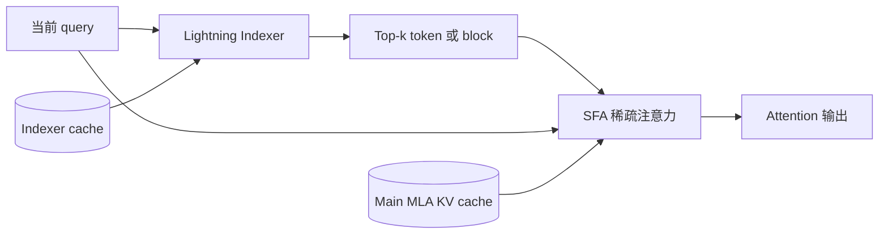
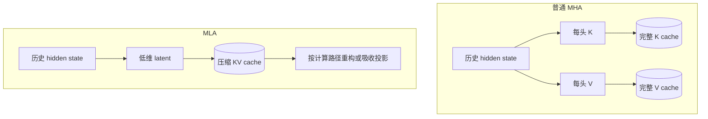
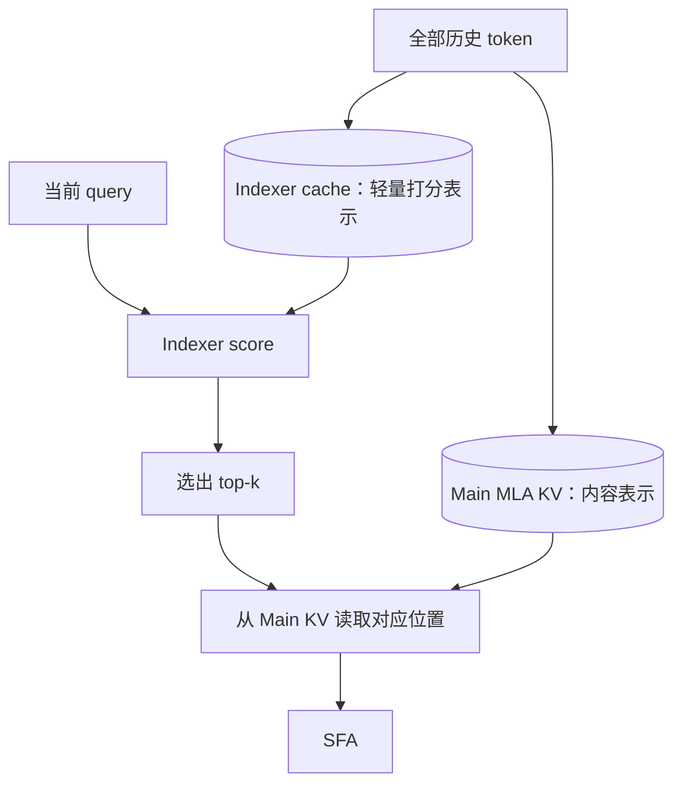
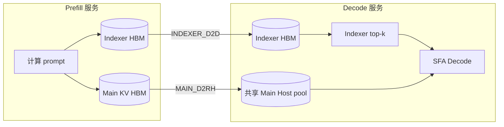
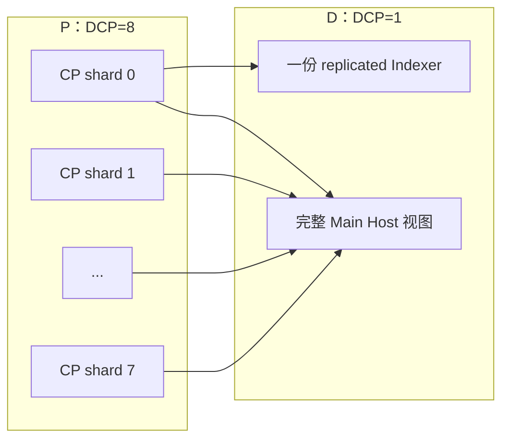
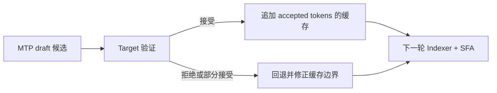

# MLA、DSA、SFA 与 blockwise PD 传输

本文解释 GLM-5.2 这类采用 MLA 与 DSA 的模型在推理阶段如何工作，以及它与当前
Mooncake blockwise P/D 分离、Main/Indexer 缓存、MTP、DCP 和 PCP 的关系。

讨论基线是 **vLLM Ascend 0.25rc1、GLM-5.2 W8A8、Mooncake 0.3.13**。
模型权重量化为 W8A8，并不能自动说明 KV、Indexer 或 Host offload 缓存的 dtype 与布局；
缓存握手仍须以运行时发布的 shape、dtype、页长和 scale 为准。

## 1. 三个概念分别解决什么问题

| 概念 | 解决的问题 | 直接影响 |
| --- | --- | --- |
| MLA（Multi-head Latent Attention） | 如何压缩并保存历史 K/V | KV cache 的表示和容量 |
| DSA（DeepSeek Sparse Attention） | 当前 query 应该关注哪些历史 token | 增加 Indexer，并把全量历史筛成 top-k |
| SFA（Sparse Flash Attention） | 如何高效计算筛选后的稀疏注意力 | NPU kernel、稀疏 Main KV 读取和 Decode 性能 |

MLA 是注意力表示方式；DSA 是模型训练得到的稀疏选择机制；SFA 是执行稀疏注意力的算子路径。
三者有关联，但不能互相替代。

DeepSeek-V2 首次系统引入 MLA；DeepSeek-V3.2-Exp 在 MLA 主干上增加了可训练的
lightning indexer 和细粒度 token 选择。公开的 FlashMLA 实现同时包含 dense MLA 与
sparse attention kernel，说明“MLA 模型”和“DSA 模型”也不是同义词。

## 2. 从一个 token 看完整数据流

Indexer cache 保存用于快速打分的索引表示。它负责回答“读哪些历史位置”。Main MLA KV cache
保存最终参与注意力计算的内容表示。它负责回答“被选中的位置里有什么”。只传 Main、不传 Indexer，
Decode 无法正确选 top-k；只传 Indexer、不传 Main，选出位置后也没有可供注意力计算的数据。

在工程实现中，top-k 可能先得到 token，再被整理成 block 或页。本文用“top-k”描述模型语义，
用“block/page”描述 vLLM 与 Mooncake 的内存和传输单位。

## 3. MLA 与普通 MHA 的差别

普通 MHA 通常按层、按头保存完整 K/V。MLA 先把 K/V 投影到较小的 latent 表示，并在计算时重构
或吸收相应投影，因此长上下文的缓存体积更小。

这也是当前代码中 Main cache 不能只按“普通 K/V 两个 tensor”理解的原因。握手中的每个位置、
block length、stride 和 scale 都必须对应模型实际的 MLA cache 布局。

## 4. 为什么 DSA 需要两类缓存

Dense MLA 会让 query 面向全部历史位置计算注意力。DSA 增加轻量 Indexer，对历史位置先做打分，
然后只让 SFA 读取被选中的 Main KV。

因此当前 blockwise DSA connector 把传输分成两相是合理的：

1. `INDEXER_D2D`：把 Indexer 从 Prefill NPU 拉到 Decode NPU。
2. `MAIN_D2RH`：把 Main KV 从 Prefill NPU 拉到 Decode 侧 Host pool。

Decode 先用本地 NPU 上的 Indexer 选位置，再由 offload/SFA 路径按需访问 Host 中的 Main KV。
这就是 `dsa_pd_offload` 的核心数据面。

## 5. P/D 分离下的数据归属

这里的“共享 Main Host pool”是当前 Decode runner/offload 的设计选择，不是 MLA 或 DSA 模型的
天然规定。现有代码让一个 Decode TP rank 作为 Main owner 写共享 Host pool，其他 TP rank 只拉各自
需要的 Indexer，并观察同一份 Host 内存。这个 TP0 owner 方案能减少重复 Main 传输，但也会让 TP0
成为带宽和完成通知的集中点。

MemFabric/Mooncake 支持多 TP 互传后，可以进一步把 Main 分片分配给多个 Decode TP rank 并行拉取，
再写入互不重叠的 Host 区域。要这样做，必须先让 connector 明确每个 Main shard 的 source endpoint、
destination byte range、完成屏障和释放责任；仅把 TP0 判断删除会造成重复写或提前释放。

## 6. DCP、PCP、DSA-CP 不是同一个开关

| 名称 | 所在阶段 | 主要作用 |
| --- | --- | --- |
| PCP | Prefill | 把长 prompt 的计算拆到多个 context ranks |
| DCP | Decode | 把历史 KV 序列拆到多个 context ranks |
| DSA-CP | DSA/SFA 专用并行路径 | 围绕 Indexer 与稀疏 attention 的模型或算子并行 |

`--decode-context-parallel-size` 出现在 P 服务命令里时，仍然叫 DCP；变量名叫
`PREFILL_DCP_SIZE` 不会把它变成 PCP。`additional_config.enable_dsa_cp` 也不能替代 DCP 或 PCP。

官方非对称 DCP 方案的方向是 P 侧 DCP>1、D 侧 DCP=1。它处理普通 Mooncake metadata 中的
remote CP 分片，并让 replicated Indexer 只需拉取一份。当前自定义 blockwise DSA 路径使用
`DsaConnectorMetadata`、`RemoteSource` 和两相 D2D/D2RH 命令，提前绕过普通 Mooncake 的 CP
split 逻辑，因此不能通过放开一个校验自然获得同样能力。

图中的 Indexer 箭头取决于它确实是 replicated cache；Main KV 是序列分片时，D 侧必须收齐所有
P CP shards。不能把八个 source physical pages 截成一个 page 后就宣布 P8/D1 语义成立。

## 7. MTP 在这张图中的位置

MTP 是 speculative decoding：draft 路径一次提出多个候选 token，target 路径验证并接受其中一段。
它不改变 Main/Indexer 的基本职责，但会增加缓存组件、manager group、完成次序和回退路径的组合。

所以“MTP 服务能启动并返回文本”只能证明配置链路可运行。要证明 MTP 与 blockwise DSA 迁移正确，
还应核对候选/接受/拒绝统计、Main/Indexer 的传输计数、首次 token 分歧和回退后的缓存边界。

## 8. 当前代码设计应守住的约束

1. 协议显式携带 P/D 的 CP size、CP rank、TP rank、cache component 和物理页 scale。
2. Main 和 Indexer 分别规划，不能假设两者 block size、复制方式或 owner 相同。
3. 非对称 CP 必须建立完整覆盖映射；source 与 destination 覆盖不一致时应失败，不能静默截断。
4. 多 TP 拉取应给每个 rank 分配互不重叠的 Host 区域，并对所有实际 source 分别发送 done/release。
5. MTP 的 target/draft cache 身份必须明确，不能只依赖 manager group 的偶然顺序。
6. 图模式只改变执行捕获，不应改变 connector 的缓存身份和完成语义；eager 通过后仍需单独验证图模式。

## 9. 术语边界

- “MLA DSA 类模型”指在 MLA 主缓存上增加 DSA Indexer 与稀疏注意力的模型家族，例如
  DeepSeek-V3.2 系列及采用相近结构的 GLM-5.2。
- `dsa_pd_offload` 是当前 vLLM Ascend connector/offload 的工程开关，不是模型结构名称。
- blockwise/layerwise 描述 KV 传输和调度粒度，不描述模型是否采用 MLA 或 DSA。
- W8A8 描述权重和激活量化，不能推出 KV、Indexer、scale 或 Host buffer 的具体 dtype。

## 参考

- [DeepSeek-V2 技术报告：MLA](https://arxiv.org/abs/2405.04434)
- [DeepSeek-V3.2-Exp：DSA](https://github.com/deepseek-ai/DeepSeek-V3.2-Exp)
- [FlashMLA：dense MLA 与 sparse attention kernels](https://github.com/deepseek-ai/FlashMLA)
- [vLLM Ascend Context Parallel 使用说明](https://docs.vllm.ai/projects/ascend/en/main/user_guide/feature_guide/context_parallel.html)
- [vLLM Ascend PR #14836：SFA 非对称 DCP](https://github.com/vllm-project/vllm-ascend/pull/14836)
